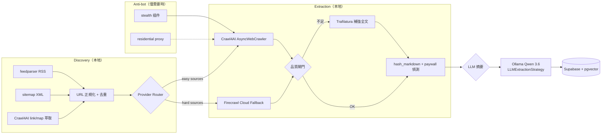

# Crawl4AI 本地爬蟲棧遷移 — Engineering Handoff Spec

## Document Status

| Field                   | Value                                          |
| ----------------------- | ---------------------------------------------- |
| Status                  | Draft for Engineering Handoff                  |
| Phase                   | Phase 1 — Crawl4AI Migration                  |
| Intended reader         | Full-stack engineer                            |
| Baseline quality target | 93+                                            |
| Last updated            | 2026-09-18                                     |

---

## 1. Purpose & Scope Lock

### 1.1 目標

本 spec 定義 BioMyne Koji 爬蟲棧從 Firecrawl Cloud 遷移至本地 Playwright + Crawl4AI + Ollama 的完整工程規格。工程師可直接照著做，不需要回問 PM。

### 1.2 In Scope

1. **Provider Abstraction**：定義 `CrawlerProvider` 介面，讓 Firecrawl 與 Crawl4AI 可切換
2. **遷移 8 個 easy sources** 至本地 provider
3. **保留 3 個 hard sources** 的 Firecrawl Cloud fallback
4. **更新 `run_pipeline.sh`** 支援 source-level routing
5. **更新 smoke_test.sh** 本地 health check
6. **Supabase `sources` 表新增 `crawler_provider` 欄位**（值：`local` / `firecrawl_cloud`）

### 1.3 Out of Scope

- ❌ 不做 GraphDB / Neo4j 整合
- ❌ 不做 dashboard 改造
- ❌ 不碰 Hermes orchestration 層
- ❌ 不做 AI extraction schema 自動生成（Crawl4AI roadmap item）
- ❌ 不做 residential proxy 整合（反爬升級留待後續）
- ❌ 不移除 Firecrawl SDK 依賴（只抽 abstraction，不删舊 path）

---

## 2. 背景與現況

### 2.1 Firecrawl 4 端點使用位置

| # | 端點 | 檔案 / 行號 | 用途 | 遷移對應 |
| --- | --- | --- | --- | --- |
| 1 | `POST /v2/map` | `ops/scripts/_discover_article_urls.py` L225–269（`firecrawl_map()`）＋ L1103 呼叫點 | URL map 發現候選文章連結 | `feedparser`（RSS）優先，Crawl4AI sitemap/link 萃取補足 |
| 2 | `POST /v1/scrape` | `ops/scripts/_scrape_markdown.py` L79–112 | 單頁抓取 → markdown（`onlyMainContent`、`waitFor`、paywall markers） | Crawl4AI `AsyncWebCrawler` markdown extraction |
| 3 | `GET /v1/team/credit-usage` | `ops/scripts/_fetch_firecrawl_credit_usage.py`（全檔） | 觀測剩餘額度 | 改由 cost 估算工具替代 |
| 4 | `POST /v1/scrape`（health check） | `ops/scripts/smoke_test.sh` L94–114 | smoke test 驗證爬蟲可用 | 改為本地 Playwright/Crawl4AI self-check |

> **注意**：`_discover_article_urls.py` 中 RSS（`feed_candidates` L583）與 sitemap（`sitemap_candidates` L618）已為本地原生存取，**只有 map surface 走 Firecrawl**。遷移後 Firecrawl 僅剩 Endpoints/BioCentury/Science 的 map/scrape 路徑。

### 2.2 Source Manifest 現況（`ops/source-manifests/biotech.yaml`）

| Source | primary_discovery_surface | fallback_discovery_surface | 遷移類別 |
| --- | --- | --- | --- |
| STAT News | rss | map | ✅ Easy |
| BioPharma Dive | rss | map | ✅ Easy |
| Nature Biotechnology | sitemap | map | ✅ Easy |
| arXiv Quantitative Biology | rss | map | ✅ Easy |
| bioRxiv | category_page | map | ✅ Easy |
| Fierce Biotech | rss | map | ✅ Easy |
| GEN – Genetic Engineering & Biotechnology News | rss | map | ✅ Easy |
| SynBioBeta | category_page | map | ✅ Easy |
| **Endpoints News** | **map** | map | ⚠️ Hard（保留 Cloud） |
| **BioCentury** | rss | map | ⚠️ Hard（保留 Cloud） |
| **Science** | rss | map | ⚠️ Hard（保留 Cloud） |

---

## 3. 目標架構



**關鍵設計決策**：
- Discovery 以 feedparser + sitemap 為主體（8/11 來源已是 RSS/sitemap 先行）
- Extraction 以 Crawl4AI 為主，Firecrawl 保留給 3 個 hard sources
- LLM 用 Ollama Qwen 3.6（`CrawlerRunConfig(llm_config=LLMConfig(provider="ollama/qwen3.6:35b-mlx"))`，v0.9.x 新 API）
- Anti-bot 只在需要時啟用（stealth/residential proxy 都不是預設值）

---

## 4. Provider Abstraction 設計（P1 核心）

### 4.1 `CrawlerProvider` 介面

新增 `ops/scripts/crawler_providers.py`，定義抽象介面：

```python
class CrawlerProvider(Protocol):
    """Abstract interface for web scraping providers."""

    async def scrape(self, url: str) -> ScrapeResult:
        """Scrape a single URL and return structured result.

        async 契約：`scrape()` 必須可 await。
        - `LocalCrawl4AIProvider`：原生 async（`AsyncWebCrawler.arun`）。
        - `FirecrawlProvider`：以 `asyncio.to_thread` 包裝同步的 Firecrawl HTTP 呼叫。
        
        Returns ScrapeResult with fields:
        - success: bool
        - markdown: str
        - word_count: int
        - content_hash: str (from _pipeline_normalization.hash_markdown)
        - paywall_detected: bool
        - paywall_signal: str | None
        - provider: str ("firecrawl_cloud" | "local")
        """
        ...

    def map(self, url: str, *, search: str | None = None, limit: int = 50) -> list[dict]:
        """Discover candidate article URLs from a given page/sitemap.
        
        Returns list of dicts with:
        - url: str
        - title: str (if available)
        - source: str (provider name)
        """
        ...
```

### 4.2 兩個實作

#### `FirecrawlProvider`

- 沿用現有 `_scrape_markdown.py` 邏輯（L79–112）
- 需要 `FIRECRAWL_KEY` 環境變數（僅在有 source 走 cloud 時必需；判定與放寬範圍見 §4.3）
- `map()` 呼叫 `firecrawl_map()` 邏輯（`_discover_article_urls.py` L225–269）
- 輸出 JSON 欄位保持不變

#### `LocalCrawl4AIProvider`

- 使用 `crawl4ai.AsyncWebCrawler`（參考 `ops/poc/crawl4ai_poc.py` L80–110）
- `scrape()` 設定：`BrowserConfig(headless=True)`；`CrawlerRunConfig(markdown_generator=DefaultMarkdownGenerator(content_filter=PruningContentFilter(threshold=0.5)), cache_mode=CacheMode.BYPASS)`（v0.9.x 新 API；`markdown=True`/`only_main_content=True` 為已棄用舊式參數）
- `map()` 使用 Crawl4AI 的 link discovery 或 sitemap XML 解析
- 需要 `pip install crawl4ai playwright && playwright install chromium`

### 4.3 切換機制

#### 雲端接觸模型與優先序

**切換層級（高 → 低）**：

1. **`CRAWLER_ALLOW_CLOUD=false`** → 強制全部本地（全域 kill-switch，忽略 DB / global 設定）
2. **`source.crawler_provider`（Supabase DB 欄位）有值** → 用它（`local` | `firecrawl_cloud`）
3. **否則** → 環境變數 `CRAWLER_PROVIDER`（env global；預設 `local`）

- `CRAWLER_ALLOW_CLOUD` 為 crawler 專用 flag：預設 `true`（穩態：8 local + 3 cloud）；`false` = 全本地（成本封頂 / 雲端隔離 / 測試用）。
- ⚠️ **不要混用**：`CRAWLER_ALLOW_CLOUD`（crawler 雲端路由）與 Hermes 的 `ENABLE_CLOUD_FALLBACK`（LLM cloud fallback 開關，`hermes/profiles/biotech-worker/config.yaml:8`）是兩個系統的獨立開關，控制對象不同；本 spec 的雲端切換一律用 `CRAWLER_ALLOW_CLOUD`。
- **憑證需求**：`FIRECRAWL_KEY` 僅在「有任何 source 走 cloud」時必需；local-only 模式（`CRAWLER_ALLOW_CLOUD=false`）下 `run_pipeline.sh`（Step 0 pre-flight）與 `smoke_test.sh` 現行的 hard-fail 檢查需放寬 — 列為 P1 實作項。
- 註：`crawler_provider` 欄位為 `NOT NULL DEFAULT 'local'`；部署後第 2 層恆有值，第 3 層（env）為欄位缺值環境的 fallback。

```sql
-- 範例：Endpoints News 保留 Firecrawl（hard source）
UPDATE sources SET crawler_provider = 'firecrawl_cloud' WHERE name = 'Endpoints News';

-- 範例：STAT News 用本地（可省略，因為欄位 DEFAULT 是 local）
-- crawler_provider = 'local'（或 NULL）→ 走 Crawl4AI 本地
```

### 4.4 相容性要求

**兩個 provider 輸出 JSON 欄位必須相容**：

| 欄位 | 類型 | 必須 | 說明 |
| --- | --- | --- | --- |
| `success` | `bool` | ✅ | 是否成功抓取 |
| `markdown` | `str` | ✅ | 抓取到的 markdown 內容 |
| `word_count` | `int` | ✅ | markdown 字數 |
| `content_hash` | `str` | ✅ | `hash_markdown()` 產生的雜湊 |
| `paywall_detected` | `bool` | ✅ | 是否偵測到 paywall |
| `paywall_signal` | `str \| None` | ✅ | paywall 類型標記 |
| `provider` | `str` | ✅ | 使用的 provider 名稱 |

`run_pipeline.sh` 只需將 `SCRAPE_JSON` 的解析邏輯從呼叫 `_scrape_markdown.py` 改為呼叫 `crawler_providers.py` 的對應方法，其他不動。

---

## 5. 要改的檔案清單

| 檔案 | 改動 | 為什麼 | 風險 |
| --- | --- | --- | --- |
| `ops/scripts/crawler_providers.py` | **新增** — `CrawlerProvider` 介面 + `FirecrawlProvider` + `LocalCrawl4AIProvider` | Provider abstraction 核心 | 低（新增檔案，不影響現有） |
| `ops/scripts/_scrape_markdown.py` | **改** — 抽出 scrape 邏輯到 `FirecrawlProvider`，保留為 wrapper | 讓 pipeline 可呼叫 provider | 中（需確保 JSON 輸出不變） |
| `ops/scripts/_discover_article_urls.py` | **改** — `firecrawl_map()` 改為呼叫 `provider.map()` | 讓 map 邏輯走 provider | 中（map 輸出格式需相容） |
| `ops/scripts/_fetch_firecrawl_credit_usage.py` | **改** — 加條件：**本輪 run 中無任何 source 走 cloud 時**才跳過 credit 觀測 | 有 source 走 cloud 即有 credit 消耗（穩態 3 個 hard sources），Free tier 1,000 credits 需持續觀測 | 低（不影響 Firecrawl 模式） |
| `ops/scripts/run_pipeline.sh` | **改** — 環境變數、fallback routing、source-level provider 決策 | 讓 pipeline 支援雙 provider | 中（shell 邏輯變動需測試） |
| `ops/scripts/smoke_test.sh` | **改** — step 4 改為本地 Crawl4AI health check | 本地模式不需要 Firecrawl API | 低（獨立測試腳本） |
| `sql/006_crawl4ai_migration.sql` | **新增** — `sources` 表加 `crawler_provider` 欄位（text NOT NULL DEFAULT 'local'） | source-level routing | 低（新增 migration） |

---

## 6. 遷移步驟（Step-by-Step）

### Step 1: 環境準備

**指令**：
```bash
pip install crawl4ai playwright trafilatura pytest
playwright install chromium
```

完成安裝後執行 `pip freeze | grep -i 'crawl4ai\|playwright\|trafilatura\|pytest' >> requirements-dev.txt` 確保版本可複現。

**驗收標準**：
- [ ] `python3 -c "from crawl4ai import AsyncWebCrawler; print('OK')"` 輸出 OK
- [ ] `playwright install chromium` 無報錯
- [ ] `python3 -c "import trafilatura; print('OK')"` 輸出 OK

---

### Step 2: Provider Abstraction 骨架

**改動**：新增 `ops/scripts/crawler_providers.py`

**內容**：
- `CrawlerProvider` Protocol（4.1 節定義的介面）
- `ScrapeResult` dataclass（4.4 節定義的欄位）
- `create_provider(name: str | None = None) -> CrawlerProvider` factory function
  - 讀取環境變數 `CRAWLER_PROVIDER`（預設 `"local"`）
  - 回傳 `LocalCrawl4AIProvider()` 或 `FirecrawlProvider()`

**驗收標準**：
- [ ] `python3 -c "from crawler_providers import create_provider; p = create_provider('local'); print(type(p))"` 輸出 `<class 'LocalCrawl4AIProvider'>`
- [ ] `python3 -c "from crawler_providers import create_provider; p = create_provider('firecrawl_cloud'); print(type(p))"` 輸出 `<class 'FirecrawlProvider'>`
- [ ] unit test：`ScrapeResult` 欄位完整（success/markdown/word_count/content_hash/paywall_detected/paywall_signal/provider）

---

### Step 3: 實作 LocalCrawl4AIProvider

**改動**：`ops/scripts/crawler_providers.py` 新增 `LocalCrawl4AIProvider`

**`scrape()` 行為**：
- 使用 `crawl4ai.AsyncWebCrawler(config=BrowserConfig(headless=True))`
- `CrawlerRunConfig(markdown_generator=DefaultMarkdownGenerator(content_filter=PruningContentFilter(threshold=0.5)), cache_mode=CacheMode.BYPASS)`
- 呼叫 `crawler.arun(url=url, config=run_cfg)`
- 回傳 `ScrapeResult`（success/markdown/word_count/content_hash/paywall_detected/paywall_signal/provider="local"）

**`map()` 行為**：
- 使用 Crawl4AI 的 link discovery 或 `urllib` 解析 sitemap XML
- 回傳 `list[dict]`（url/title/source）

**驗收標準**：
- [ ] `python3 -c "from crawler_providers import create_provider; import asyncio; p = create_provider('local'); r = asyncio.run(p.scrape('https://www.biorxiv.org/content/10.1101/2026.01.01.123456v1')); print(r.success, r.word_count)"` 輸出 `True <positive int>`
- [ ] content_hash 非空
- [ ] paywall_detected 為 False（公開頁面）

---

### Step 4: Source-level Routing

Step 4 的 source-level routing 決策基於 Supabase `sources` 表（pipeline 基礎資料源）：`run_pipeline.sh` 的 source 清單來自 Supabase REST（`GET /rest/v1/sources?enabled=eq.true`），並非直接讀 YAML manifest。

**改動**：
- `sql/006_crawl4ai_migration.sql` — **新增** migration（sql/001 已套用不可改），內容為 `ALTER TABLE sources ADD COLUMN IF NOT EXISTS crawler_provider text NOT NULL DEFAULT 'local';`
- `ops/scripts/run_pipeline.sh` — 在 iterate sources 時讀取 `crawler_provider` 欄位，決定該 source 走 Crawl4AI 或保留 Firecrawl
- `ops/source-manifests/biotech.yaml` — 保持為 discovery surface 規則的輔助文件，與 pipeline 資料流解耦（不加 provider 欄位）

**路由邏輯**（`run_pipeline.sh` 內）：
```bash
# Step 2 的 Supabase sources 查詢帶入完整欄位清單（現行欄位 + crawler_provider）
supa GET "/rest/v1/sources?select=id,name,url,domain,source_type,extraction_mode,refresh_enabled,refresh_window_days,refresh_cadence_hours,refresh_priority,crawler_provider&enabled=eq.true"
# iterate 每個 source 時依 §4.3 優先序決定 provider：
#   1. CRAWLER_ALLOW_CLOUD=false → 一律 local（kill-switch）
#   2. crawler_provider='firecrawl_cloud' → 走 Firecrawl（3 個 hard sources）
#   3. 其餘（'local' 或 NULL）→ 走 Crawl4AI 本地
ALLOW_CLOUD="${CRAWLER_ALLOW_CLOUD:-true}"
PROVIDER=$(echo "$SRC_JSON" | python3 -c "import sys,json; print(json.load(sys.stdin).get('crawler_provider') or 'local')")
[ "$ALLOW_CLOUD" = "false" ] && PROVIDER="local"
```

**驗收標準**：
- [ ] `sources` 表新增 `crawler_provider` 欄位（text NOT NULL DEFAULT 'local'）
- [ ] `Endpoints News`（hard source）的 `crawler_provider='firecrawl_cloud'`，routing 走 Firecrawl
- [ ] 其他 easy sources 的 `crawler_provider='local'`（或 NULL），走 Crawl4AI 本地
- [ ] 更新 sources 表不需動到 manifest（routing 以 DB 為準）
- [ ] 環境變數 `CRAWLER_PROVIDER=local` 時，所有非 override sources 走本地；`CRAWLER_ALLOW_CLOUD=false`（kill-switch）時則一律本地（忽略 DB / global 設定）

---

### Step 5: 遷移 8 個 Easy Sources 並驗證

**來源清單**：STAT News, BioPharma Dive, Nature Biotechnology, arXiv Quantitative Biology, bioRxiv, Fierce Biotech, GEN, SynBioBeta

**驗收標準**（每個 source）：
- [ ] `scrape()` 成功（success=True）
- [ ] word_count ≥ `MIN_WORDS_FOR_LLM`（依 `.env` 配置；repo 預設 100）
- [ ] content_hash 在 normalize 後穩定率 ≥ 現況 Firecrawl 基線。具體驗證方法：隨機選 5 篇 easy source 文章，各抓取 2 次，計算 hash 相同比例。Accept if ≥ 80%。若 < 80%，需調整 `hash_markdown()` 的 normalize 邏輯（如去除動態 DOM 片段）再重新驗證
- [ ] `run_pipeline.sh` 單 source 測試通過
- [ ] 抓取成功率 ≥ 95%（樣本：20 runs、≤1 fail）

---

### Step 6: Hard Sources Fallback 驗證

**來源清單**：Endpoints News, BioCentury, Science

**驗收標準（兩個情境）**：

情境 A — 穩態（`CRAWLER_ALLOW_CLOUD=true`）：
- [ ] `Endpoints News`：`crawler_provider='firecrawl_cloud'` 生效，走 Firecrawl `/v2/map`
- [ ] `BioCentury`：RSS 正常抓取，paywall 頁面偵測到 `paywall_detected=True`（cloud 路徑）
- [ ] `Science`：RSS 正常抓取，全文 paywall 偵測正常

情境 B — kill-switch（`CRAWLER_ALLOW_CLOUD=false`）：
- [ ] 全部 hard sources 走本地、不 crash（degraded 模式；雲端路徑不被觸發）

---

### Step 7: 清理與文件更新

**改動**：
- `ops/scripts/smoke_test.sh` — step 4 改為本地 Crawl4AI health check
- `ops/scripts/_fetch_firecrawl_credit_usage.py` — 加「本輪 run 無任何 source 走 cloud 時跳過 credit 觀測」條件
- `docs/phase1/local-crawler-stack-evaluation.md` — 加遷移完成標記
- `.env` — 加 `CRAWLER_PROVIDER=local` 與 `CRAWLER_ALLOW_CLOUD=true` 預設值

**驗收標準**：
- [ ] `smoke_test.sh` 在 `CRAWLER_PROVIDER=local` 時全部 pass
- [ ] 本輪 run 無任何 source 走 cloud 時，`_fetch_firecrawl_credit_usage.py` 不呼叫 Firecrawl API（穩態仍有 3 個 hard sources 消耗 credits，需持續觀測）
- [ ] `.env` 有 `CRAWLER_PROVIDER=local` 與 `CRAWLER_ALLOW_CLOUD=true`

---

## 7. Acceptance Criteria（DoD）

| # | 條件 | 測量方式 |
| --- | --- | --- |
| AC-1 | 8 easy sources 用本地 provider 抓取成功率 ≥ 95% | `run_pipeline.sh` 單 source 跑 20 runs、≤1 fail |
| AC-2 | content_hash 去重率維持（不因渲染差異導致重複文章重跑 LLM） | `content_hash` 一致性測試 |
| AC-3 | LLM 分析覆蓋率 ≥ 現況（`MIN_WORDS_FOR_LLM` 通過率不降） | pipeline run log |
| AC-4 | 成本工具顯示本地 $4.32/mo | `estimate_crawler_cost.py` 輸出 |
| AC-5 | Firecrawl 路徑保留，環境變數切回 `firecrawl_cloud` 時原路徑正常 | `CRAWLER_PROVIDER=firecrawl_cloud` 跑 smoke_test.sh |
| AC-6 | 3 hard sources 的 `crawler_provider='firecrawl_cloud'` 在 Supabase `sources` 表生效（前提：`CRAWLER_ALLOW_CLOUD=true`；設 `false` 時全域強制本地），pipeline log 確認走 Firecrawl `/v2/map` 或 `/v1/scrape` | `sources` 表欄位查詢 + pipeline log |

---

## 8. 測試計畫

> **測試檔案位置**：`ops/tests/`（pytest；`requirements-dev.txt` 需加入 pytest）。

### 8.1 Unit Tests

| 測試 | 內容 | 預期 |
| --- | --- | --- |
| `test_scrape_result_fields` | `ScrapeResult` 包含所有 7 個必要欄位 | pass |
| `test_content_hash_stability` | 同一 markdown 兩次 `hash_markdown()` 結果相同 | pass |
| `test_paywall_detection` | 含 `PAYWALL_MARKERS` 的 markdown 偵測為 True | pass |
| `test_provider_factory` | `create_provider("local")` 回傳 `LocalCrawl4AIProvider` | pass |

### 8.2 Integration Tests

| 測試 | 內容 | 預期 |
| --- | --- | --- |
| `test_local_scrape_biorxiv` | 本地 provider 抓 bioRxiv 公開頁 | success=True, word_count ≥ `MIN_WORDS_FOR_LLM`（repo 預設 100） |
| `test_local_scrape_statnews` | 本地 provider 抓 STAT News | success=True, word_count ≥ `MIN_WORDS_FOR_LLM`（repo 預設 100） |
| `test_firecrawl_provider` | Firecrawl provider 抓 STAT News | success=True（需 FIRECRAWL_KEY） |

### 8.3 回歸測試

| 測試 | 內容 | 預期 |
| --- | --- | --- |
| `smoke_test_firecrawl` | `CRAWLER_PROVIDER=firecrawl_cloud` 跑 smoke_test.sh | 全 pass |
| `smoke_test_local` | `CRAWLER_PROVIDER=local` 跑 smoke_test.sh | 全 pass |
| `pipeline_single_source` | `run_pipeline.sh` 單 source 跑完整流程 | 無 error |

---

## 9. 風險與回滾

| 風險 | 影響 | 機率 | Rollback 計畫 |
| --- | --- | --- | --- |
| 反爬封鎖（Cloudflare/PerimeterX） | 來源抓不到 | 中 | 該 source 的 `crawler_provider` 更新為 `'firecrawl_cloud'`，routing 改走 Firecrawl |
| content_hash 飄移 | 重複文章重跑 LLM | 中 | 調高 dedupe 容忍度；沿用 `hash_markdown()` normalize |
| Crawl4AI 版本升級破壞 | pipeline crash | 低 | `requirements-dev.txt` pin 版本；`pip install crawl4ai==0.9.3` |
| Ollama 不可用 | LLM 分析失敗 | 低 | 沿用現有 fallback（跳過 LLM，只存 markdown） |
| Playwright chromium crash | 單頁抓取失敗 | 低 | retry 邏輯（沿用 `MAX_ATTEMPTS` pattern）；必要時切 Firecrawl |

**通用 rollback（三個手段）**：

1. **單一 source 回滾**：把該 source 的 `crawler_provider` 更新回 `'firecrawl_cloud'`（Supabase `sources` 表）→ 該來源立即回到 Firecrawl 路徑。
2. **全域 kill-switch**：`CRAWLER_ALLOW_CLOUD=false` → 忽略 DB / env 設定、全部走本地（degraded；用於成本封頂或雲端路徑故障隔離）。
3. **env 切換**：`CRAWLER_PROVIDER=firecrawl_cloud` → 無 DB 值的來源回到 Firecrawl（第 3 層 fallback）。

---

## 10. 參考資料

| 資料 | 路徑 / URL |
| --- | --- |
| 本地 Crawler Stack 評估 memo | `docs/phase1/local-crawler-stack-evaluation.md` |
| Crawl4AI PoC 腳本 | `ops/poc/crawl4ai_poc.py` |
| 成本估算工具 | `ops/scripts/estimate_crawler_cost.py` |
| Source manifest | `ops/source-manifests/biotech.yaml` |
| Crawl4AI 官方文件 | https://docs.crawl4ai.com/ |
| Playwright Python 文件 | https://playwright.dev/python/ |
| Trafilatura 文件 | https://trafilatura.readthedocs.io/ |
| Phase 1 Engineering Spec（格式參考） | `docs/phase1/engineering-spec.md` |
| Firecrawl API 文件 | https://docs.firecrawl.dev/ |
