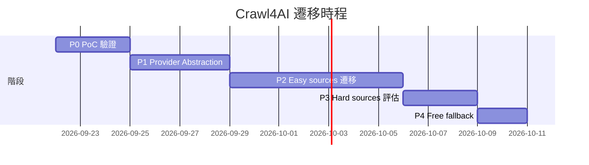

# Crawl4AI 本地爬蟲棧遷移 — Stakeholder Overview

> **文件狀態**：Proposal  
> **日期**：2026-09-17  
> **版本**：v1.0  
> **作者**：BioMyne Engineering  
> **目標讀者**：老闆、非技術 stakeholder、投資人  
> **基線品質目標**：93+

---

## Executive Summary

BioMyne Koji 目前使用 Firecrawl Cloud（月費 $16）爬取 11 個生技情報來源，每日約 660 篇文章。這個依賴造成三個問題：**持續性月費支出**、**生技情報送入第三方雲端**、以及**新增來源受 credit 上限限制**。

深度研究已完成評估：使用本地 **Playwright + Crawl4AI + Ollama** 組合取代 Firecrawl「有條件可行」。11 個來源中 **8 個可直接遷移**，其餘 3 個保留 Cloud fallback。遷移後月成本從 **$16 降至 ~$4.32（僅電費）**，年省 **~$140**，同時資料完全留在本地。

遷移不影響現有功能。系統保留 Firecrawl Free tier 作為最後防線，確保任何來源異常時自動回退。預計 **2–3 週分階段完成**，每階段有明確驗收標準。

**建議**：進行遷移，同時保留 Firecrawl Free tier 作為 fallback。

---

## 1. 為什麼要遷移

### 驅動力 1：成本

| 指標 | 現況（Firecrawl Cloud） | 遷移後（本地） |
| --- | --- | --- |
| 月費 | $16/mo（Hobby plan, 5000 credits） | ~$4.32/mo（電費） |
| 年成本 | $192 | ~$52 |
| **年省** | — | **~$140** |
| 額度限制 | 5000 credits/mo，超出需加購 | **無上限** |

Mac Studio M3 Ultra 96GB 已購入（折舊另計），爬蟲僅佔 30W 功耗。成本工具 `ops/scripts/estimate_crawler_cost.py` 可參數化試算。

### 驅動力 2：資料隱私

生技情報（藥物研發進展、臨床試驗、企業併購）具有高度商業敏感度。現狀下每篇文章的 HTML 內容都送入 Firecrawl 雲端伺服器處理。

遷移後，所有抓取、解析、LLM 分析 **100% 在本地 Mac Studio 完成**，內容不出內網。

### 驅動力 3：彈性

目前每新增一個來源，就消耗更多 Firecrawl credit。本地方案讓我們可以：
- 新增任意數量的來源，不受 credit 限制
- 針對特定來源調整抓取策略（等待時間、選擇器、反爬設定）
- 未來整合更多 LLM 分析管道（本地 Ollama 已零 token 成本）

---

## 2. 遷移前後對比

| 維度 | Firecrawl Cloud（現況） | 本地 Crawl4AI Stack（目標） |
| --- | --- | --- |
| **月成本** | $16（5000 credits） | ~$4.32（電費） |
| **資料隱私** | 內容送第三方雲端 | 全部本地，不出內網 |
| **來源彈性** | 受 credit 上限限制 | 無上限，隨意新增 |
| **維運負擔** | 零（雲端 SLA） | 需管理 browser binary + Crawl4AI 版本 |
| **反爬能力** | 雲端 proxy + stealth（較強） | 本地 stealth plugin（需調校） |
| **LLM 分析** | 另需 ~$89/mo token 訂閱 | Ollama 本地，零成本 |
| **Vendor lock-in** | 高（API schema 綁定） | 無（open source + 標準 Playwright API） |

---

## 3. 效益量化

### 成本節省

| 項目 | Firecrawl Cloud | 本地（Mac Studio） |
| --- | --- | --- |
| 月費 | $16/mo | ~$4.32/mo（電費） |
| 電費計算 | — | 30W × 24h × 30d × $0.2/kWh ≈ $4.32/mo |
| 年成本 | $192 | ~$52 |
| **年省** | — | **~$140** |

> 以上為概估範圍。實際節省以 `ops/scripts/estimate_crawler_cost.py` 參數化試算為準。
>
> Hobby 定價範圍 $16–19/mo（依促銷），以上以工具預設 $16/mo 為準。重跑：`python3 ops/scripts/estimate_crawler_cost.py --articles 660 --scrape-credits 3`

### 無形效益

- **資料隱私**：生技情報不出本地，降低洩漏風險
- **無 credit 上限**：來源數量與抓取頻率不再受商業方案限制
- **LLM 成本歸零**：本地 Ollama Qwen 分析不需額外 token 費用
- **自主可控**：不依賴第三方服務 uptime 與定價變動

---

## 4. 風險與緩解

### 3 個關鍵前提

遷移不是免費的。我們必須明確承擔以下前提，否則只是把雲端 vendor lock-in 換成另一組隱性維運成本。

| # | 前提 | 說明 | 緩解措施 |
| --- | --- | --- | --- |
| P1 | **反爬不是免費的** | Playwright stealth plugin 單獨使用僅 ~5% pass rate；需 residential IP + fingerprint 才有 ~70% | 保留 Cloud fallback 給高風險來源；本地加 request delay + stealth |
| P2 | **「零配置任意網站」是話術** | 已知結構來源近乎零配置，但新來源仍需 2–4 hr/來源 per-pattern config | 遷移 8 個已知來源（低成本），未來新增來源編列配置預算 |
| P3 | **要守住內容品質閘門** | Playwright 渲染結果可能因 CDN/廣告動態內容飄移，影響 `content_hash` 去重 | 沿用 `_pipeline_normalization.hash_markdown()` 去重邏輯，接受較高 dedupe 率 |

### 3 個保留 Cloud 的來源

| 來源 | 理由 |
| --- | --- |
| **Endpoints News** | `/feed` 與 `/rss` 皆 403（Cloudflare 類保護），map 為 primary |
| **BioCentury** | 文章頁部分 paywall，Crawl4AI 無法繞過登入牆 |
| **Science** | RSS 正常但全文常被 paywall 遮蔽 |

---

## 5. 里程碑時程

| 階段 | 內容 | 時間估算 | 產出 |
| --- | --- | --- | --- |
| **P0 PoC** | 單頁抓取驗證（bioRxiv / STAT News） | 2–3 天 | markdown + LLM extraction 可行性報告 |
| **P1 Provider Abstraction** | 抽象爬蟲介面，Firecrawl/本地可切換 | 3–4 天 | 可切換的 scrape/map 實作 |
| **P2 Easy sources** | 8/11 來源遷移至本地 | 5–7 天 | 來源 manifest 更新、pipeline 全本地跑通 |
| **P3 Hard sources** | Endpoints/BioCentury/Science 評估 | 2–3 天 | 保留 Cloud fallback 的 routing 規則 |
| **P4 Free fallback** | Firecrawl Free tier 當最後防線 | 1–2 天 | 成本接近 $0，僅高風險來源觸發 |
| **總計** | | **2–3 週** | |

---

## 6. 成功指標

怎麼知道遷移成功？以下三個指標必須維持或提升：

| 指標 | 基線（Firecrawl） | 目標（遷移後） | 測量方式 |
| --- | --- | --- | --- |
| **抓取成功率** | ~95%（Firecrawl 穩定） | ≥ 95%（8 easy sources） | pipeline run log |
| **content_hash 去重率** | 現有基線 | 維持（不因渲染差異導致重複文章重跑 LLM） | `_pipeline_normalization` output |
| **LLM 分析覆蓋率** | 現有基線 | ≥ 現況（`MIN_WORDS_FOR_LLM` 通過率不降） | pipeline run log |

**決策閘**：P2 Easy sources 完成後，若任一 source 抓取成功率 < 80% 或 LLM 分析覆蓋率低於現況，該 source 回滾至 Firecrawl Cloud，並進行根因分析後決定是否繼續嘗試。

---

## 7. 決策建議

**建議進行遷移，同時保留 Firecrawl Free tier 作為 fallback。**

理由：
1. **成本效益明確**：年省 ~$140，無額度上限
2. **資料隱私提升**：生技情報不出本地
3. **風險可控**：3 個 hard sources 保留 Cloud fallback，Firecrawl Free tier 當最後防線
4. **一次性投入低**：8 個 easy sources 約 8–16 hr 一次性配置成本
5. **未來彈性高**：新增來源不受 credit 限制，LLM 分析零成本

**下一步**：啟動 P0 PoC（2–3 天），驗證本地抓取品質後正式進入開發。

---

## 附錄：參考資料

- `docs/phase1/local-crawler-stack-evaluation.md` — 完整技術評估 memo
- `ops/poc/crawl4ai_poc.py` — Crawl4AI PoC 腳本
- `ops/scripts/estimate_crawler_cost.py` — 成本對比工具
- Crawl4AI 官方文件（v0.9.3，Apache 2.0，70K+ stars）
- Firecrawl 定價頁（Hobby $16–19/mo, 5000 credits; Free 1000 一次性）
- hiQ Labs v. LinkedIn 判例（公開資料抓取不違 CFAA，但 ToS 契約違反有效）
