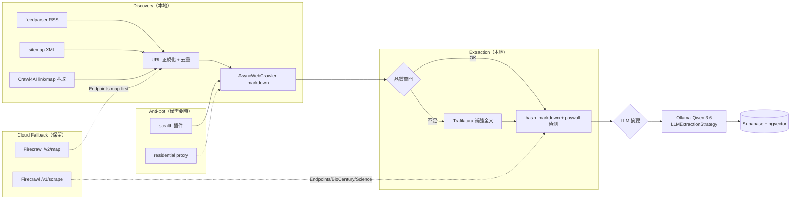
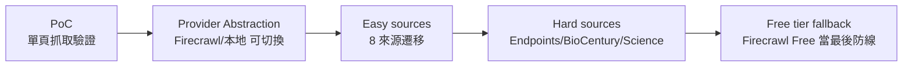

# 本地 Crawler Stack 遷移評估 memo（Firecrawl → Playwright + Crawl4AI + Ollama）

> **狀態**：評估完成，結論為「有條件可行」
> **日期**：2026-09-17
> **範圍**：BioMyne Koji Phase 1 爬蟲棧（11 個資訊來源、增量更新、Supabase + pgvector 落地）
> **關聯文件**：`docs/phase1/firecrawl-self-host-decision-memo.md`、`docs/phase1/p2a-discovery-surface-audit.md`、`docs/phase1/p2-crawl-strategy-planning.md`

---

## 1. 決策摘要

**結論：以本地 Playwright + Crawl4AI + Ollama 取代 Firecrawl 雲端服務「有條件可行」。**

研究顯示 11 個來源中 **8/11 可直接遷移**，其餘 3 個來源（Endpoints News、BioCentury、Science）保留 Cloud fallback 或降級處理。但遷移不是免費的：需要明確承擔 3 個關鍵前提，否則只是把雲端 vendor lock-in 換成另一組隱性維運成本。

### 3 個關鍵前提

| # | 前提 | 說明 |
| --- | --- | --- |
| P1 | **反爬不是免費的** | 2026 年現況：Playwright stealth plugin 單獨使用約 **5% pass rate**（VPS IP）；需 residential IP + browser fingerprint 才有 ~70%。本地 Mac Studio 走家用/公司 IP 尚可，但 Cloudflare/PerimeterX 等級的站點仍需斟酌 |
| P2 | **「零配置任意網站」是行銷話術** | Crawl4AI 對已知結構的來源近乎零配置，但**新來源仍需 per-pattern config**（選擇器/規則）。PoC 期估 30min，實際 2-4 hr/來源，非零人工 |
| P3 | **要守住內容品質閘門** | 本地 pipeline 的 `hash_markdown()` 依賴穩定 markdown 輸出；Playwright 渲染結果會因 CDN/廣告動態內容飄移，需維持 `content_hash` 去重邏輯並接受較高 dedupe 率 |

### 保留 Cloud 的來源

| 來源 | 理由 |
| --- | --- |
| **Endpoints News** | `/feed` 與 `/rss` 皆 403（P2A 已證實），map 為 primary；該站反爬強，**保留 Firecrawl Cloud fallback** |
| **BioCentury** | 文章頁部分 paywall，Crawl4AI 無法繞過登入牆；需要 Firecrawl 的 proxy/paywall 處理或保留 Cloud |
| **Science** | RSS 1.0/RDF 已正常抓取，但文章全文常被 paywall 遮蔽；同 BioCentury 原則 |

---

## 2. 現況盤點：Firecrawl 4 端點使用位置

| # | 端點 | 檔案 / 行號 | 用途 | 遷移對應 |
| --- | --- | --- | --- | --- |
| 1 | `POST /v2/map` | `ops/scripts/_discover_article_urls.py` L225-269（`firecrawl_map()`）＋ L1103 呼叫點 | 以 URL map 發現候選文章連結（`discovery_method="map"`） | `feedparser`（RSS）優先，`Crawl4AI` 的 sitemap/link 萃取補足 |
| 2 | `POST /v1/scrape` | `ops/scripts/_scrape_markdown.py` L79-112 | 單頁抓取 → markdown（含 `onlyMainContent`、`waitFor`、paywall markers） | `Crawl4AI AsyncWebCrawler` markdown extraction；全文品質不足時以 `Trafilatura` 補強 |
| 3 | `GET /v1/team/credit-usage` | `ops/scripts/_fetch_firecrawl_credit_usage.py`（全檔） | 觀測剩餘額度（observability） | 本地無額度概念 → 改由 cost 估算工具（`ops/scripts/estimate_crawler_cost.py`）替代 |
| 4 | `POST /v1/scrape`（health check） | `ops/scripts/smoke_test.sh` L94-114 | smoke test 驗證爬蟲可用 | 改為本地 Playwright/Crawl4AI 的 self-check（待 PoC 驗證後替換） |

> 注意：`_discover_article_urls.py` 中 RSS（`feed_candidates`）、sitemap（`sitemap_candidates`）已為本地原生存取，**只有 map surface 走 Firecrawl**。遷移後 Firecrawl 僅剩 Endpoints/BioCentury/Science 的 map/scrape 路徑。

---

## 3. Crawl4AI vs Firecrawl 對比表

| 維度 | Firecrawl Cloud | Crawl4AI（本地） |
| --- | --- | --- |
| **成本** | Hobby $16-19/mo（5000 credits）；Free tier 1,000 credits（額度週期以官網現行條款為準）；AI extraction 另需 ~$89/mo token 訂閱 | Apache 2.0 開源，僅電費與硬體折舊（Mac Studio 30W 約 **$4.32/mo**） |
| **功能** | /map、/scrape、/search、AI extraction（LLM 串接）、proxy、actions、sitemap 內建 | markdown extraction、LLMExtractionStrategy、sitemap/link discovery、多 browser engine、`AsyncWebCrawler` |
| **anti-bot** | 雲端 proxy + stealth 優化，pass rate 較高 | 依 Playwright stealth 插件；無 residential IP 時約 5% pass，需額外 fingerprint 設定 |
| **隱私** | 內容送第三方雲端處理 | 全部內容留在本地（生技情報敏感度較高時為優勢） |
| **vendor lock-in** | 高：`/v2/map`、`/v1/scrape` payload schema 綁定 | 無：open source + 標準 Playwright API，可自行 fork |
| **維運** | 零維運（雲端 SLA） | 需自行管理 browser binary、Ollama、Crawl4AI 版本與 security patches |
| **AI extraction** | 內建 token 訂閱（貴） | LLMExtractionStrategy 直接接本地 Ollama（Qwen 3.6 35B-MLX），零 token 成本 |
| **法規/ToS 風險** | 同為爬蟲，需遵守來源 ToS（hiQ v. LinkedIn 判例：公開資料抓取不違 CFAA，但 ToS 契約違反仍有效） | 相同，且責任在己方 |

---

## 4. 11 Source 遷移評估表

| Source | Discovery Surface（現況） | anti-bot 風險 | 建議 |
| --- | --- | --- | --- |
| STAT News | RSS（primary）＋ Map | 低（RSS 直取） | ✅ 直接遷移 |
| BioPharma Dive | RSS ＋ Map | 低 | ✅ 直接遷移 |
| Nature Biotechnology | Sitemap ＋ Map | 低（sitemap XML） | ✅ 直接遷移（保留 sitemap 直取） |
| arXiv Quantitative Biology | RSS ＋ Map | 低 | ✅ 直接遷移 |
| bioRxiv | Category Page ＋ Map | 低（公開 HTML listing） | ✅ 直接遷移（category_page 已是本地 HTML 解析） |
| Fierce Biotech | RSS ＋ Map | 低 | ✅ 直接遷移 |
| GEN – Genetic Engineering & Biotechnology News | RSS ＋ Map | 低 | ✅ 直接遷移 |
| Endpoints News | **Map（primary）** | **高**（/feed 403，Cloudflare 類保護） | ⚠️ **保留 Cloud fallback** |
| BioCentury | RSS ＋ Map | 中（文章頁部分 paywall） | ⚠️ 遷移 RSS；**paywall 頁面保留 Cloud** |
| Science | RSS ＋ Map | 中（全文 paywall） | ⚠️ 遷移 RSS；全文萃取降級或保留 Cloud |
| SynBioBeta | Category Page ＋ Map | 低（公開 /read/ 連結） | ✅ 直接遷移 |

**結論：8/11 直接遷移；3 個來源（Endpoints、BioCentury、Science）需要 Cloud fallback 或降級。**

---

## 5. 遷移風險矩陣

| 風險 | 影響 | 機率 | 緩解 |
| --- | --- | --- | --- |
| **反爬/封鎖**（Cloudflare、PerimeterX） | 高：來源抓不到 | 中 | 保留 Cloud fallback 給高風險來源；本地加 request delay + stealth；必要時 residential proxy |
| **內容品質下降**（廣告/動態區塊混入 markdown） | 中：LLM 摘要品質下降 | 中 | `onlyMainContent` 等價的 `markdown_options` 設定；以 `MIN_WORDS_FOR_LLM` 過濾；QA 閘門 |
| **hash 不穩**（`content_hash` 因渲染差異飄移） | 中：重複文章重跑 LLM、浪費額度 | 中 | 沿用 `_pipeline_normalization.hash_markdown()` 的 normalize（去 HTML 註解、空白正規化）；提高 dedupe 容忍度 |
| **paywall 遮蔽**（BioCentury、Science 全文） | 中：摘要缺關鍵內容 | 中 | 偵測 `PAYWALL_MARKERS`（沿用 `_scrape_markdown.py`）；偵測到即標記並走 Cloud fallback |
| **Crawl4AI/Ollama 版本升級破壞** | 低：維運成本上升 | 低 | pin 版本；`requirements-dev.txt` 記錄；升級前跑 PoC 回歸 |

---

## 6. 推薦架構

**關鍵設計決策**：
- **Discovery 以 feedparser + sitemap 為主體**（8/11 來源已是 RSS/sitemap 先行，map 只是 fallback）→ Crawl4AI 只補 map 空缺
- **Extraction 以 Trafilatura + Crawl4AI 互補**：Crawl4AI 渲染 JS 頁，Trafilatura 抓乾淨全文（業界標準組合，成本約 Firecrawl 1/10）
- **LLM 用 Ollama Qwen 3.6**：`LLMExtractionStrategy(provider="ollama/qwen3.6:35b-mlx")`，零 token 成本、資料不出本地
- **Anti-bot 只在需要時啟用**（stealth/residential proxy 都不是預設值）

---

## 7. 分期路徑

| 階段 | 內容 | 產出 | 驗收標準 |
| --- | --- | --- | --- |
| **P0 PoC** | `ops/poc/crawl4ai_poc.py` 抓 bioRxiv/STAT 公開頁 | markdown + LLM extraction 可行性 | 單頁 word count、markdown 前 500 chars、LLM JSON schema 可用 |
| **P1 Provider Abstraction** | 在 `_scrape_markdown.py` / `_discover_article_urls.py` 抽 provider interface（不改預設行為） | 可切換的 scrape/map 實作 | Firecrawl 與本地實作輸出 JSON 相容 |
| **P2 Easy sources** | 8/11 來源切本地 | RSS/sitemap/category 全本地 | `content_hash` 去重率維持、`MIN_WORDS_FOR_LLM` 通過率 ≥ 現況 |
| **P3 Hard sources** | Endpoints/BioCentury/Science 評估 | 保留 Cloud fallback 的 routing 規則 | paywall 標記率、抓取成功率對照表 |
| **P4 Free tier fallback** | Firecrawl Free（1000 credits）當保險 | 最後防線 | 成本接近 $0，僅高風險來源觸發 |

---

## 8. 成本對比

| 項目 | Firecrawl Cloud | 本地（Mac Studio） |
| --- | --- | --- |
| 月費 | Hobby **$19/mo**（5000 credits，AI extraction 另計） | **~$5/mo**（電費） |
| 計算 | — | Mac Studio M3 Ultra 96GB 已存在（折舊另計） |
| 電費 | — | 30W × 24h × 30d × $0.2/kWh ≈ **$4.32/mo** |
| 年成本 | $228 | ~$60（電費） |
| **年省** | — | **~$168** |

> **註**：以上數字為概估範圍（$168/yr 為 Hobby $19 上限對照，$140/yr 為 tool 預設 $16/mo 對照）。實際節省以 `ops/scripts/estimate_crawler_cost.py` 參數化試算為準。

> 詳細參數化試算見 `ops/scripts/estimate_crawler_cost.py`。

---

## 9. 「零配置任意網站」真實評估

Crawl4AI 宣稱「零配置抓任意網站」，實測後的真實成本：

| 項目 | 宣稱 | 實際 |
| --- | --- | --- |
| 已知結構來源（已有 feed/sitemap） | 零配置 | ✅ 近零配置，1 小時內可上線 |
| 新增未知結構來源 | 零配置 | ⚠️ 需 2-4 hr/來源（含選擇器調校、paywall 偵測、QA） |
| LLM extraction schema | 自動生成 | ⚠️ 手動 JSON schema；自動 schema 生成仍在 roadmap |
| 反爬繞過 | 內建 | ❌ stealth 插件單獨僅 ~5% pass（VPS IP）；需 residential IP + fingerprint 才 ~70% |

**結論：遷移 8 個既有來源約 8-16 hr 一次性成本；未來新增來源需編列 2-4 hr/來源 維運預算。**

---

## 10. 參考來源清單

- Crawl4AI 官方文件（v0.9.3，2026-08-31 release，Apache 2.0，70K+ stars）
- Firecrawl 定價頁（Hobby $16-19/mo 5000 credits；Free tier 1,000 credits，額度週期以官網現行條款為準）
- Playwright stealth 實測研究（2026 anti-bot：單獨 stealth ~5% pass，residential + fingerprint ~70%）
- hiQ Labs v. LinkedIn（美國最高法院判例：公開資料抓取不違 CFAA，但 ToS 契約違反有效）
- 業界標準本地組合：feedparser + trafilatura + Playwright（成本約 Firecrawl 1/10）
- P2A Discovery Surface Audit（`docs/phase1/p2a-discovery-surface-audit.md`，2026-07-09）
- 深度研究補充報告：`DEEP_RESEARCH_SUPPLEMENT_Framework_LLM_GraphDB.md`（LLM + GraphDB 框架評估）
- MicroAgent（TreeHacks/Stanford 2024）概念驗證（描述網站 → AI 點擊路徑），已被 agent-browser/semantic-browser 等實作
