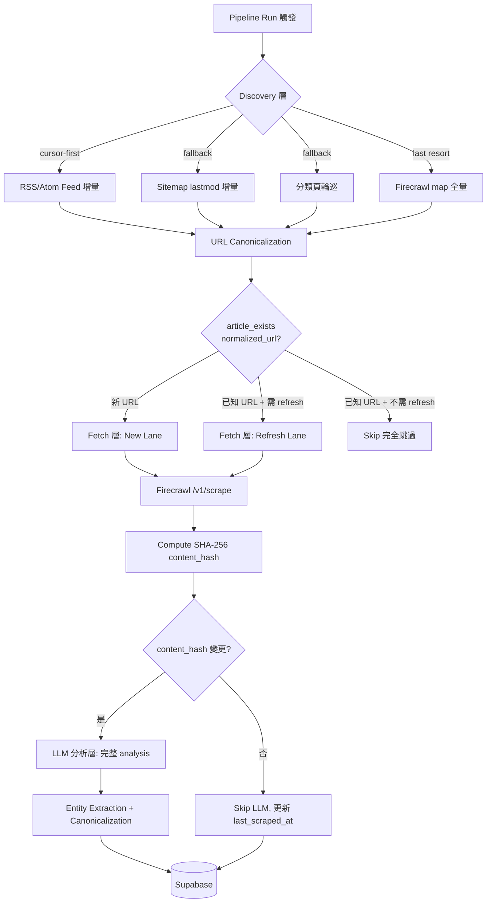

# BioMyne Koji P2 爬蟲策略深度規劃書

> **版本**：v2.1（P2A 實作完成，進度追蹤更新）
> **日期**：2026-07-08
> **狀態**：P2A 實作完成 + 端到端驗證通過，進入 P2A 穩定觀察期
> **範疇**：P2 規劃與共識建立 + P2A 核心實作
> **品質模式**：strict（93+）
> **研究方法**：Jarvis Deep Research 雙通道獨立研究 + Firecrawl 官方文檔交叉驗證 + 現有 repo 程式碼分析
> **輸出語言**：繁體中文

---

## 執行摘要

### 核心發現

1. **Firecrawl `/v2/map` 極其便宜**：計費單位是「每次 API 呼叫 1 credit」，而非「每筆回傳 URL 1 credit」。11 個來源每日各 map 一次，月耗僅 ~330 credits（約 $0.27）。Map 不是成本瓶頸。
2. **真正的成本瓶頸是重複 scrape**：每篇文章 1 credit。若每次 run 都 scrape 全部候選文章（含已在資料庫中的），月耗可達 5,000+ credits。但 Koji 已有 `articles.url` UNIQUE constraint + `article_exists()` 做 exact URL dedupe，重複 scrape 的風險已被控制。
3. **最大的浪費是重複 discovery（map）而非重複 scrape**：雖然 map 便宜，但每次都對全部來源做 map（而非用 RSS/sitemap/category page cursor 做增量），代表每 run 都在重複發現大量已知 URL 再逐一跳過。這不是 credit 浪費，而是**信號效率浪費**。
4. **P2 的核心命題應重新定義**：不是「省 Firecrawl credits」，而是「提高 discovery 信號品質 + 建立 refresh 能力以偵測內容更新 + 避免對未變內容重複 LLM 分析」。
5. **P2A 的最大即時收益不是「scrape credits 大降」，而是 discovery 去雜訊、URL 變體去重、以及為未來 refresh lane 建立 stateful 基礎**。`content_hash` 直接節省的是 LLM 分析，不是既有單篇 scrape credits。

### 三層防線架構



### 成本影響模型（11 來源，每日一 run，月 30 run）

> 下表是 **planning envelope**，不是批准級財務預測。現階段唯一較穩的 baseline 是目前雲端 credits 大約落在 `~4,830 / month` 的量級。P2A 的直接 Firecrawl credits 收益主要來自 `map` 減量與 URL 變體去重；`content_hash` 主要節省的是 **LLM token / analysis 成本**，不是既有單篇 scrape credits。

| 情境                                            |   Map Calls/月   |    Scrape/月     | 對 Firecrawl Credits 的方向性影響        | 主要收益                                                           | 信心 |
| ----------------------------------------------- | :--------------: | :--------------: | ---------------------------------------- | ------------------------------------------------------------------ | :--: |
| **現狀**（P0/P1 後）                            |       330        |      ~4,500      | baseline                                 | 已有 exact URL dedupe                                              |  中  |
| **P2A**（前提：完成 RSS/sitemap surface audit） |     ~44–220      |   ~4,300–4,500   | **小幅下降**，不是劇烈下降               | discovery 去雜訊、map 減量、URL 變體去重、為 refresh lane 建 state | 中低 |
| **P2B**（+ refresh lane + 分類頁輪巡）          |     ~44–220      |   ~4,400–5,300   | **持平到上升**                           | freshness / revision capture / category signal 提升                |  低  |
| **P2C**（+ budget modes + 完整 throttle）       | policy-dependent | policy-dependent | **可控，但以 coverage / freshness 交換** | 成本上限治理，而不是天然省錢                                       |  中  |

> 補充：若只看 LLM 與分析成本，`content_hash + analysis_fingerprint` 在 refresh lane 啟用後的節省潛力通常會比 Firecrawl credits 節省更大。

### 優先級建議

| 優先級  |    階段    | 核心機制                                                                        | ROI 排名 | 理由                                              |
| :-----: | :--------: | ------------------------------------------------------------------------------- | :------: | ------------------------------------------------- |
| **P0**  | ✅ 已完成  | MAX_ARTICLES_PER_SOURCE 提升、per-source overrides、discovery breadth tuning    |    —     | 已落地                                            |
| **P2A** |  立即啟動  | URL normalization + content hash + RSS/sitemap cursor + entity canonicalization |    #1    | 最低成本、最高防禦覆蓋、為 P2B/P2C 建立基礎設施   |
| **P2B** | P2A 穩定後 | Refresh lane + 分類頁輪巡 + analysis fingerprint + entity batch merge           |    #2    | 需要 P2A 的基礎設施（content_hash、cursor state） |
| **P2C** |  有數據後  | Budget modes + per-run caps + credit 監控                                       |    #3    | 需要 P2A/P2B 的營運數據來校準閾值                 |

---

## 1. 現狀深度分析

### 1.1 已完成（P0/P1 Hardening）

本輪（2026-07-08 `crawler-strategy-hardening-v1`）已落地的改進：

| 改進                                                         | 位置                                 | 效果                                                           |
| ------------------------------------------------------------ | ------------------------------------ | -------------------------------------------------------------- |
| `MAX_ARTICLES_PER_SOURCE` 3 → 15                             | `run_pipeline.sh` L22                | 每來源候選文章量提升 5×                                        |
| `MAX_ARTICLES_PER_SOURCE_OVERRIDES` 機制                     | `run_pipeline.sh` L44-76             | STAT News=20、Nature Biotech=18、Science=10 等 per-source 客製 |
| `DISCOVERY_MAP_LIMIT_MULTIPLIER` / `DISCOVERY_MAP_MIN_LIMIT` | `_discover_article_urls.py` L224-228 | Firecrawl map 取回廣度可調（預設 multiplier=20, min=80）       |
| `DISCOVERY_DATE_SCORE_BONUS` 8 → 4                           | `_discover_article_urls.py` L259     | 降低對最新文章的評分偏向                                       |
| `DISCOVERY_MIN_CANDIDATE_SCORE` 5 → 4                        | `_discover_article_urls.py` L270     | 讓更多潛在相關文章進入候選                                     |
| Nature Biotechnology supplemental sitemap                    | `_discover_article_urls.py` L300-309 | 從 0 candidates 修復到可產出多個 article URLs                  |

### 1.2 現有去重保護（已存在、不需重建）

| 保護層       | 機制                                             | 位置                                 | 保護範圍                            |
| ------------ | ------------------------------------------------ | ------------------------------------ | ----------------------------------- |
| Discovery 層 | `article_exists(url)` exact URL check            | `_discover_article_urls.py` L170-186 | 防止已知 URL 進入候選               |
| DB 層        | `articles.url` UNIQUE constraint                 | `sql/001_phase1_core_schema.sql` L30 | 防止完全相同 URL 重複 INSERT        |
| DB 層        | `entities.(name, entity_type)` UNIQUE constraint | `sql/001_phase1_core_schema.sql` L47 | 防止完全相同 entity 重複            |
| Write 層     | `_write_pipeline_output.py` upsert logic         | `_write_pipeline_output.py` L68-90   | GET-before-POST 防止 race condition |

### 1.3 仍然存在的效率缺口

| 缺口                       | 說明                                                                       | 影響                             | P2 對策                                          |
| -------------------------- | -------------------------------------------------------------------------- | -------------------------------- | ------------------------------------------------ |
| **URL normalization 缺失** | `https://example.com/page` vs `https://example.com/page/` 被視為不同 URL   | 同一文章可能被重複 scrape + 分析 | P2A: `normalize_url()` + `normalized_url` UNIQUE |
| **重複 map 呼叫**          | 每次 run 都對全部來源做 map，即使大部分 URL 已知                           | 信號效率低，且佔用 rate limit    | P2A: cursor-first discovery                      |
| **無法偵測內容更新**       | 已知 URL 永久跳過，無法發現同一 URL 的內容變更（preprint v1→v2、新聞更正） | 資訊可能過時                     | P2B: refresh lane + content hash                 |
| **重複 LLM 分析**          | 若未來引入 refresh，同一內容可能被重複分析                                 | LLM token 浪費                   | P2A: content hash skip                           |
| **Entity 名稱變體**        | "Pfizer" vs "Pfizer Inc." 被視為不同 entity                                | Entity 表膨脹、關聯碎片化        | P2A: canonicalization                            |
| **無 credit 監控**         | 無法追蹤每次 run 的 Firecrawl 消耗                                         | 無法做預算管理                   | P2C: credit usage capture                        |

---

## 2. 三層去重防線 — 深度設計

### 2.1 Discovery 層：避免重複發現已知 URL

#### 2.1.0 P2A0 前置門檻：Discovery Surface Audit（阻塞條件）

在批准 P2A 前，必須先完成一個小型 evidence sprint，驗證每個 pilot source 的 discovery surface：

1. RSS / Atom feed URL 是否存在且可穩定解析
2. sitemap 或 sitemap index 是否存在，且 `lastmod` 是否可用
3. 若前兩者都不可靠，是否存在可輪巡的 category / TOC 頁面
4. 各 surface 的更新延遲、可觀測性與失敗模式

**沒有完成這個 surface audit，不應直接批准 `map calls 330 -> 44` 這種級別的收益預期。**

**P2A0 建議執行規則**：

| 項目            | 建議                                                                                                                                                                                                                                         |
| --------------- | -------------------------------------------------------------------------------------------------------------------------------------------------------------------------------------------------------------------------------------------- |
| Owner           | PM / research owner + engineering owner 共同完成                                                                                                                                                                                             |
| 時間盒          | 2–3 個工作天                                                                                                                                                                                                                                 |
| 初始 scope      | 先做 5 個 pilot sources，不要求 11 個來源一次完成                                                                                                                                                                                            |
| 必交 artifact   | 每個 pilot source 一行記錄：`primary surface`、`fallback surface`、`sample URL`、`freshness signal`、`known failure mode`                                                                                                                    |
| Go / No-Go 門檻 | 至少 80% 的 pilot sources 必須各自找到 1 個可用 primary surface，且每個 source 都有明確 fallback；另外 pilot 中每一種 source family（新聞媒體 / 學術期刊 / preprint）都至少要有 1 個通過案例；若未達標，P2A 不進入實作，先回到 planning 修正 |

**P2A0 完成的判定標準**：不是「所有來源都完美」，而是「pilot 範圍內已能明確回答每個來源先走 RSS、sitemap、category，還是只能暫時保留 map fallback」。

#### 2.1.1 RSS/Atom Feed Cursor（最高 ROI）

**技術基礎**：

- RSS 2.0 使用 `pubDate`（RFC 822 格式）；Atom 1.0 使用 `updated`（RFC 3339 格式）
- Python `feedparser` 庫可統一解析兩種格式並返回標準化的 `published_parsed`（UTC 9-tuple）
- 每個 entry 有 `<id>`（Atom）或 `<guid>`（RSS）作為 primary dedup key — 比 URL 更可靠（同一文章可能被多個 feed 收錄）

**Cursor 邏輯**：

```
1. 從 source_discovery_state 讀取 last_cursor_published_at
2. Fetch feed URL（帶 If-None-Match / If-Modified-Since headers）
3. 若 HTTP 304 → feed 無更新，結束
4. 解析 feed entries，只處理 published > last_cursor_published_at 的 entry
5. 對每個新 entry，用 entry.id/guid 做 primary dedup，entry.link 做 secondary dedup
6. 更新 last_cursor_published_at = max(published of processed entries)
```

**HTTP 層優化**：

- 發送 `If-None-Match`（ETag）和 `If-Modified-Since`（Last-Modified）headers
- 收到 304 Not Modified 時跳過解析 — 零頻寬、快速

**各來源 RSS/Atom 可用性初步評估（研究判斷，不等於實測完成）**：

| 來源                 |   RSS/Atom 可用    |   日期可靠性    | 建議            |
| -------------------- | :----------------: | :-------------: | --------------- |
| STAT News            |     🟢 有 RSS      |      🟢 高      | 優先使用        |
| BioPharma Dive       |     🟢 有 RSS      |      🟢 高      | 優先使用        |
| Nature Biotechnology | 🟡 可能有 AOP feed |      🟢 高      | 需確認 feed URL |
| Fierce Biotech       |     🟢 有 RSS      |      🟢 高      | 優先使用        |
| GEN                  |     🟢 有 RSS      |      🟢 高      | 優先使用        |
| Endpoints News       |     🟢 有 RSS      |      🟢 高      | 優先使用        |
| BioCentury           |  🔴 高度 paywall   | 🔴 RSS 幾乎無用 | 依賴分類頁      |
| SynBioBeta           |     🟡 可能有      |      🟡 中      | 需確認          |
| arXiv q-bio          |  🟢 有 Atom feed   |      🟢 高      | 優先使用        |
| bioRxiv              |     🟢 有 RSS      |      🟢 高      | 優先使用        |
| Science              |     🟡 可能有      |      🟢 高      | 需確認 feed URL |

> 以上表格只代表研究階段的初步判斷；真正批准 P2A 前，仍需完成 `P2A0 surface audit`。

**Fallback 策略**：

- Feed 無日期 → 退回到 URL-based dedup
- Feed 連續失敗 N 次 → 自動 fallback 到 sitemap cursor 或 Firecrawl map
- Feed 延遲更新 → 設定 `cooldown_until` 避免過度重試

#### 2.1.2 Sitemap lastmod Cursor

**lastmod 可靠性**（來源：Bing Webmaster Blog 2023）：

- 84% 的 sitemap 包含 `lastmod` 屬性
- 其中 79% 的值是正確的
- 最常見問題：`lastmod` 被設為 sitemap 生成日期而非內容實際修改日期
- Google 採用 **binary trust model**：要麼完全信任，要麼完全忽略

**對 BioMyne 各類來源的適用性**：

| 來源類型                    | lastmod 可靠性 | 原因                                      |
| --------------------------- | :------------: | ----------------------------------------- |
| 學術期刊（Nature、Science） |     🟢 高      | CMS（Atypon、HighWire）自動從出版日期生成 |
| Preprint（bioRxiv、arXiv）  |     🟢 高      | 每次提交自動更新                          |
| 大型新聞（STAT、Endpoints） |     🟡 中      | 有 CMS 自動化但可能與生成日期混淆         |
| 小型媒體                    |     🔴 低      | 手動維護或 WordPress 插件設為當前日期     |

**Sitemap Index 處理**：

1. Fetch sitemap index（`<sitemapindex>` 根元素）
2. 解析所有子 sitemap URL
3. 只處理 `lastmod > last_sitemap_checkpoint` 的子 sitemap
4. 記錄每個子 sitemap 的處理進度（而非每次都重拉整個 sitemap）

**Koji 現有基礎**：`_discover_article_urls.py` 已有 `load_xml_sitemap()` 函數，可在此基礎上擴充 sitemap index 支援。

#### 2.1.3 URL Canonicalization（第一優先實作）

**RFC 3986 Section 6 標準化階梯**：

**必須做（Semantics-preserving）**：

1. Scheme 轉小寫：`HTTP://` → `http://`
2. Host 轉小寫：`Example.COM` → `example.com`
3. Percent-encoding 十六進位大寫：`%3a` → `%3A`
4. 解碼 unreserved 字元：`%7E` → `~`
5. 移除 dot-segments：`/foo/./bar/../baz` → `/foo/baz`
6. 空 path 轉 "/"：`http://example.com` → `http://example.com/`
7. 移除預設 port：`:80`、`:443`

**建議做但要小心**：8. **Trailing slash**：這是最大的模糊地帶。對學術 DOI URL（`/content/10.1101/xxx`）不做變更；對新聞 URL 保留原始格式，僅在來源自身不一致時移除 9. **www ↔ non-www**：手動設定 per-source canonical domain mapping 10. **Tracking parameter 移除**：UTM（`utm_source`、`utm_medium`、`utm_campaign`）、`fbclid`、`gclid`、`ref`、`source` — **強烈建議移除**

**不建議做（或需 per-source 設定）**：11. 排序 query parameters：風險較高，先用 Firecrawl 的 `ignoreQueryParameters: true` 處理

**影響量化**：DUST 研究（Schonfeld et al., WWW 2007）指出正確的 DUST 規則可消除 URL 列表中高達 **68%** 的冗餘 URI。對 Koji 的 map-heavy workflow 尤其有意義。

**建議實作位置**：在 `_discover_article_urls.py` 中新增 `normalize_url(url)` 函數，在 `article_exists()` 檢查前和 DB INSERT 前都先 normalize。

**Source family normalization policy（先定規則，避免實作漂移）**：

| Source family             | Trailing slash                        | Query params                         | Host / scheme                         | 備註                                           |
| ------------------------- | ------------------------------------- | ------------------------------------ | ------------------------------------- | ---------------------------------------------- |
| 新聞媒體文章 URL          | 以 publisher 現況為準，不主動加 slash | 移除 tracking params                 | lowercase host / default port removal | 重點是消除 `utm_*`, `fbclid`, `gclid`, `ref`   |
| DOI / journal article URL | 不主動改 trailing slash               | 一般無 query，若有 tracking 一樣移除 | lowercase host / default port removal | 避免碰 path semantics                          |
| preprint content URL      | 不主動改 trailing slash               | 一般無 query，若有 tracking 一樣移除 | lowercase host / default port removal | 對 `/content/10.1101/...`、`/abs/...` 保守處理 |

#### 2.1.4 Per-Source Cursor State（基礎設施）

**建議新增 `source_discovery_state` 表**：

```sql
CREATE TABLE source_discovery_state (
  source_id uuid PRIMARY KEY REFERENCES sources(id),
  cursor_type text NOT NULL,               -- 'rss', 'sitemap', 'category_page', 'map_fallback'
  last_discovery_at timestamptz,           -- 最後一次 discovery 的時間
  last_cursor_published_at timestamptz,    -- RSS pubDate / sitemap lastmod 的最大值
  last_cursor_url text,                    -- 最後處理到的 URL（category page cursor）
  last_map_at timestamptz,                 -- 最後一次 Firecrawl map 的時間
  last_sitemap_checkpoint jsonb,           -- 每個子 sitemap 的最後處理時間
  last_successful_discovery_at timestamptz, -- 最後一次成功 discovery
  cooldown_until timestamptz,              -- 冷卻期（避免過度重試故障來源）
  error_count integer NOT NULL DEFAULT 0,  -- 連續失敗次數（用於自動 fallback）
  updated_at timestamptz NOT NULL DEFAULT now()
);
```

補充：`source_discovery_state.last_cursor_url` 只應用於 source-global cursor surface（如 RSS / sitemap）。對 category / TOC 目標，應使用 `source_category_targets.last_seen_url` 作為 **per-target local cursor**；跨 target 的重複則由 `articles.normalized_url` 的 global dedupe 處理。

#### 2.1.5 Cursor Selection / Failover Policy（先定規則，後寫程式）

對每個 source，discovery surface 的選擇優先序必須固定，不可在實作時臨場發揮：

1. `RSS/Atom`：前提是 URL 已驗證、解析穩定、日期欄位可信
2. `Sitemap / Sitemap Index`：前提是 `lastmod` 可用或至少 URL surface 比 feed 更穩定
3. `Category / TOC Page`：前提是目標頁結構穩定且 stop condition 已定義
4. `Firecrawl map`：只作 bootstrap、fallback、或週期 reconciliation

建議 failover 規則：

- 每次 discovery run 結束時，更新一次當前 active surface 的 `error_count`
- 同一 active surface 連續 `error_count >= 3` → 進入 `cooldown_until`
- 進入 cooldown 後，在**下一次** discovery run 才切到下一優先序 surface，避免單次 run 內來回抖動
- 若 fallback surface 也失敗，依序再切到下一個可用 surface；只有在所有較高優先序 surface 不可用或處於 cooldown 時，才回到 `map`
- 每個 source 必須只有一個 `active discovery surface`，避免多 surface 同時產出同一批 URL 造成決策混亂

建議 recovery 規則：

- 每日或每週對非 active surface 做輕量 health probe
- probe 成功後，不立即切回，只在連續 N 次成功後恢復主用地位
- 若所有 candidate surfaces 同時處於 cooldown，系統應顯式標記 source 為 `degraded`，並採用 `map` 作為最後保底模式，而不是靜默失效

---

### 2.2 Fetch 層：避免重複 scrape 同一 URL

#### 2.2.1 現有 UNIQUE Constraint 的保護邊界

| 情境                                                      |        會被擋嗎？         | 說明                       |
| --------------------------------------------------------- | :-----------------------: | -------------------------- |
| 完全相同 URL 重複 INSERT                                  |           ✅ 是           | `articles.url UNIQUE`      |
| `https://example.com/page` vs `https://example.com/page/` |           ❌ 否           | Trailing slash 不同        |
| `http://example.com/page` vs `https://example.com/page`   |           ❌ 否           | Scheme 不同                |
| `?utm_source=twitter` vs `?ref=email` vs 無參數           |           ❌ 否           | Query params 不同          |
| 內容更新但 URL 不變                                       | ✅ 是（但這不是我們要的） | 正確地被擋，但內容可能過時 |

**修復方案**：在 `articles` 表新增 `normalized_url` 欄位（加 UNIQUE constraint），INSERT 前先 normalize URL。

#### 2.2.2 已知 URL Refresh 策略

**哪些來源需要 refresh**：

| 來源類型                    | 更新情境                 |     頻率      |         Refresh 窗口建議          |
| --------------------------- | ------------------------ | :-----------: | :-------------------------------: |
| Preprint（bioRxiv、arXiv）  | 版本更新（v1→v2→v3）     |  數週至數月   | 發布後 30 天內：7 天；之後：30 天 |
| 學術期刊（Nature、Science） | Correction、Retraction   |  罕見但重要   |               30 天               |
| 新聞媒體（STAT、Endpoints） | 更正、breaking news 補充 | 發布後 24-72h |        發布後 7 天內：3 天        |
| 產業分析（BioCentury）      | 幾乎不更新               |       —       |          不自動 refresh           |
| 其他                        | 少見更正                 |       —       |             手動觸發              |

**Refresh 決策規則**：

```
needs_refresh(url) = True IF:
    source_published_at 在 refresh 窗口內
    AND last_scraped_at 距今超過 refresh 窗口
    AND source 類型屬於「更新傾向」類別
```

**Refresh window 配置原則**：這些窗口不應放在單一全域 `.env`。最小可行做法應是 per-source policy，至少包含：

- `refresh_enabled`
- `refresh_window_days`
- `refresh_cadence_hours`
- `refresh_priority`

這些欄位可先加在 `source_discovery_state`，或拆成獨立 `source_refresh_policy` 表；關鍵是讓 preprint、journal、news 可各自配置，不被單一全域值綁死。

#### 2.2.3 兩通道模型

| 通道             | 用途                        | Scrape 時機 |      LLM 分析時機      |
| ---------------- | --------------------------- | :---------: | :--------------------: |
| **New Lane**     | 從未見過的 URL              |    立即     |          立即          |
| **Refresh Lane** | 已知 URL，在 refresh 窗口內 |    立即     | 僅 content_hash 變更時 |

**Firecrawl changeTracking 的應用**：

- Basic mode（無額外 credit cost）可在 refresh scrape 時返回 `new/same/changed/removed` 狀態
- 若 `changeStatus == 'same'`，可跳過 content hash 計算（Firecrawl 已在服務端完成比對）
- 注意：`changeTracking` 需要在 `/v2/scrape` 端點使用（Koji 目前使用 `/v1/scrape`）

---

### 2.3 LLM 層：避免重複分析未變內容

#### 2.3.1 Content Hash 策略（最高 ROI 單一機制）

**業界標準**：SHA-256 of normalized markdown。

**Normalization 步驟**（每一步都有具體目的）：

```python
import hashlib, unicodedata, re

def normalize_markdown_for_hash(md: str) -> str:
    # 1. Unicode NFC normalization — 統一不同編碼的相同字元
    md = unicodedata.normalize('NFC', md)
    # 2. 移除 HTML comments — 不影響文章語意
    md = re.sub(r'<!--.*?-->', '', md, flags=re.DOTALL)
    # 3. Collapse 多個空白為單一空格
    md = re.sub(r'[ \t]+', ' ', md)
    # 4. 統一換行符為 \n
    md = re.sub(r'\r\n?', '\n', md)
    # 5. Trim per-line + overall whitespace
    md = '\n'.join(line.strip() for line in md.split('\n'))
    md = md.strip()
    # 6. Lowercase — markdown heading 大小寫不影響語意
    md = md.lower()
    return md

def content_hash(md: str) -> str:
    return hashlib.sha256(
        normalize_markdown_for_hash(md).encode('utf-8')
    ).hexdigest()
```

**Hash Algorithm 選擇**：

| Algorithm         | 速度 |        碰撞風險        | 建議                                               |
| ----------------- | :--: | :--------------------: | -------------------------------------------------- |
| SHA-256           |  中  | 極低（cryptographic）  | ✅ **推薦** — 行業標準，PostgreSQL 內建 `digest()` |
| xxHash (xxh3_128) | 極快 |    低（non-crypto）    | 適合極大規模                                       |
| MD5               |  快  | 低（known collisions） | 可接受但不推薦新專案                               |

**儲存策略**：

- `articles.content_hash` TEXT (64 chars for SHA-256 hex)
- 建立 index：`CREATE INDEX idx_articles_content_hash ON articles(content_hash);`
- 允許跨來源的相同內容偵測（如 syndicated content）

#### 2.3.2 Analysis Fingerprint

記錄 LLM analysis 的輸入參數，判斷何時需要重新分析：

```json
{
  "prompt_template_version": "v1.2",
  "model": "qwen3.6:35b-mlx",
  "temperature": 0.3,
  "content_hash": "abc123...",
  "analysis_type": "summary+tags+entities"
}
```

**Invalidation 規則**：

- `content_hash` 改變 → **必須**重新分析
- `prompt_template_version` 改變 → 可選擇重新分析
- `model` 改變 → 建議重新分析
- 僅 `temperature` 改變 → 不需重新分析

#### 2.3.3 建議新增的 `articles` 欄位

```sql
ALTER TABLE articles ADD COLUMN normalized_url text;
ALTER TABLE articles ADD COLUMN source_published_at timestamptz;
ALTER TABLE articles ADD COLUMN discovery_method text;       -- 'rss','sitemap','category_page','map'
ALTER TABLE articles ADD COLUMN last_scraped_at timestamptz;
ALTER TABLE articles ADD COLUMN content_hash text;           -- SHA-256 hex
ALTER TABLE articles ADD COLUMN analysis_version text;
ALTER TABLE articles ADD COLUMN analysis_fingerprint jsonb;
ALTER TABLE articles ADD COLUMN last_analyzed_at timestamptz;

CREATE UNIQUE INDEX idx_articles_normalized_url ON articles(normalized_url);
CREATE INDEX idx_articles_content_hash ON articles(content_hash);
```

---

## 3. 分類/標籤頁面爬取策略

### 3.1 為何分類頁比首頁 map 更有效

**各頁面類型的信號強度排名**：

| 排名 | 頁面類型                |  信號強度  | 適用來源 | 說明                               |
| :--: | ----------------------- | :--------: | -------- | ---------------------------------- |
|  1   | Category/Topic 頁面     | 🟢 85-95%  | 新聞媒體 | 編輯人工分類，每篇連結皆相關       |
|  2   | Recent Submissions 頁面 | 🟢 95-100% | Preprint | 新提交論文，零雜訊                 |
|  3   | Current Issue TOC       | 🟢 95-100% | 學術期刊 | 當期目錄，全為 peer-reviewed       |
|  4   | Early Release 頁面      | 🟢 90-100% | 學術期刊 | 提前線上發表                       |
|  5   | 首頁                    | 🟡 40-60%  | 全部     | 混合最新+推薦+導航+廣告            |
|  6   | 全站 Sitemap/Map        | 🔴 20-40%  | 全部     | 包含關於、聯絡、隱私、舊文、作者頁 |

**三種策略比較**：

| 策略                 |           Credit 消耗           | 信號密度 |            維護成本             |
| -------------------- | :-----------------------------: | :------: | :-----------------------------: |
| 首頁 map（現有預設） |          1 credit/call          | ~40-60%  |               低                |
| 分類頁 map           |          1 credit/call          | ~80-95%  |    中（需維護分類 URL 列表）    |
| 分類頁 HTML parse    | **0 credits**（不經 Firecrawl） | ~90-100% | 高（需 per-source 自訂 parser） |

### 3.2 分類頁增量發現策略

**Stop Condition 設計**：

1. **`last_seen_url` stop**：以單一 `category / TOC target` 為作用域；當該 target 的逆時間序列已走到自己的 `last_seen_url` 時停止（最可靠）
2. **`published_at` age stop**：文章日期超過閾值 → 停止（輔助）
3. **`max_pages` hard cap**：每個分類頁最多翻 5 頁 → 安全網

**作用域規則**：

- `source_category_targets.last_seen_url` 是 **per-target local cursor**
- `articles.normalized_url` 是 **global dedupe guardrail**
- 若 page 2 再次遇到 page 1 已見過的文章，應由 global dedupe 吃掉，但不應因此提前停止其他 category target 的輪巡

**分頁處理**：

- 偵測 `rel="next"` 連結或 `<nav class="pagination">`
- JS 渲染的分頁（infinite scroll）不在 Phase 2 範圍
- 安全上限：每分類頁最多 5 頁（可配置）

**網站改版漂移處理**：

- HTTP 狀態碼變更（200→404/301）→ 即時偵測
- 候選文章產出量驟降 >70% → 下次 run 偵測
- 自動禁用該分類目標 + fallback 到 map → 發送 Telegram 警報

### 3.3 每個來源的具體分類頁建議

#### 新聞媒體（`homepage_links` 來源）

| 來源               | 推薦分類頁 1                    | 推薦分類頁 2           | 推薦分類頁 3      |
| ------------------ | ------------------------------- | ---------------------- | ----------------- |
| **STAT News**      | `/category/biotech/`            | `/category/pharma/`    | `/topic/biotech/` |
| **BioPharma Dive** | `/topic/pharma/`                | `/topic/biotech/`      | `/topic/deals/`   |
| **Fierce Biotech** | `/biotech/`                     | `/research/`           | —                 |
| **GEN**            | `/category/topics/` → 子 topics | `/news/`               | —                 |
| **Endpoints News** | `/news/`                        | `/channel/pharma/`     | —                 |
| **SynBioBeta**     | `/read/`                        | `/article/`            | —                 |
| **BioCentury**     | `/editions/weekly`              | `/analysis/hot-topics` | —                 |

#### 學術期刊

| 來源                     | 推薦分類頁 1                     | 推薦分類頁 2          | 推薦分類頁 3                      |
| ------------------------ | -------------------------------- | --------------------- | --------------------------------- |
| **Nature Biotechnology** | `/nbt/current-issue`             | `/nbt/articles`       | `/nbt/advance-online-publication` |
| **Science**              | `/toc/science/current` ✅ 已使用 | `/toc/sciadv/current` | `/toc/scitranslmed/current`       |

#### Preprint Server

| 來源            | 推薦分類頁 1                      | 推薦分類頁 2               | 推薦分類頁 3                         |
| --------------- | --------------------------------- | -------------------------- | ------------------------------------ |
| **arXiv q-bio** | `/list/q-bio/new` ✅ 已使用       | `/list/q-bio/recent`       | `/list/q-bio.BM/new`（Biomolecules） |
| **bioRxiv**     | `/content/early/recent` ✅ 已使用 | `/collection/biochemistry` | `/collection/synthetic-biology`      |

### 3.4 分類頁維護基礎設施

**建議新增 `source_category_targets` 表**：

```sql
CREATE TABLE source_category_targets (
  id uuid PRIMARY KEY DEFAULT gen_random_uuid(),
  source_id uuid NOT NULL REFERENCES sources(id),
  name text NOT NULL,
  url text NOT NULL,
  priority text NOT NULL DEFAULT 'medium',    -- 'high','medium','low'
  enabled boolean NOT NULL DEFAULT true,
  check_frequency interval NOT NULL DEFAULT '1 day',
  last_seen_url text,                          -- 上次看到的最新文章 URL
  last_seen_published_at timestamptz,
  last_checked_at timestamptz,
  last_error text,                             -- 最近的錯誤訊息
  error_type text,                             -- 'http_error','parse_error','empty_result'
  detected_at timestamptz,                     -- 錯誤偵測時間
  created_at timestamptz NOT NULL DEFAULT now(),
  updated_at timestamptz NOT NULL DEFAULT now()
);
```

---

## 4. Firecrawl Credit 預算管理

### 4.1 計費模型確認（經 Firecrawl 官方文檔驗證）

| Endpoint                                   |            Credit 消耗            | Koji 使用？ |
| ------------------------------------------ | :-------------------------------: | :---------: |
| `/v2/map`                                  | **1 credit / call**（非 per URL） |    ✅ 是    |
| `/v1/scrape` basic                         |          1 credit / page          |    ✅ 是    |
| `/v1/scrape` changeTracking basic/git-diff |  1 credit / page（無額外 cost）   |  未來可用   |
| `/v1/scrape` changeTracking JSON mode      |       **5 credits / page**        |  ❌ 不建議  |
| `/v1/scrape` Stealth Mode                  |         5 credits / page          |  ❌ 不需要  |

**關鍵洞察**：Koji 的成本模型極其單純 = `map calls + scrape calls = total credits`。

### 4.2 三段預算模式

以「預計月底剩餘 credits」為觸發基礎（結合 billing period 剩餘天數）：

> 這些閾值目前只能視為 **初始假設**，不應在 production 中當成精準治理規則。至少要有 2–4 週真實消耗資料後，才應校準成正式閾值。

| 模式         | 觸發條件                  | 行為                                                                          |
| ------------ | ------------------------- | ----------------------------------------------------------------------------- |
| **normal**   | 預計月底剩餘 >30% of plan | 全部功能啟用                                                                  |
| **conserve** | 預計月底剩餘 10-30%       | 停 map reconciliation、停低優先級來源的 refresh、停低優先級分類頁             |
| **critical** | 預計月底剩餘 <10%         | 僅保留 RSS/sitemap cursor discovery + high priority 來源的 scrape + hash skip |

**觸發邏輯**：

```python
daily_burn_rate = credits_used_this_period / days_elapsed
projected_remaining = remaining_credits - (daily_burn_rate * days_left)

if projected_remaining > plan_credits * 0.30:   mode = 'normal'
elif projected_remaining > plan_credits * 0.10: mode = 'conserve'
else:                                            mode = 'critical'
```

### 4.3 Per-Run 上限建議

| 參數                          | Normal | Conserve |   Critical    |
| ----------------------------- | :----: | :------: | :-----------: |
| `max_map_calls_per_run`       |   15   |    5     | 0（不用 map） |
| `max_scrapes_per_run`         |  200   |   100    |      50       |
| `max_refresh_scrapes_per_run` |   50   |    20    |       0       |

### 4.4 建議新增的 `crawl_runs` 欄位

```sql
ALTER TABLE crawl_runs ADD COLUMN remaining_credits_before integer;
ALTER TABLE crawl_runs ADD COLUMN remaining_credits_after integer;
ALTER TABLE crawl_runs ADD COLUMN budget_mode text;        -- 'normal','conserve','critical'
ALTER TABLE crawl_runs ADD COLUMN map_calls integer DEFAULT 0;
ALTER TABLE crawl_runs ADD COLUMN scrape_calls integer DEFAULT 0;
ALTER TABLE crawl_runs ADD COLUMN refresh_scrape_calls integer DEFAULT 0;
```

### 4.5 Firecrawl 429 Rate Limit 處理改進

現有 retry logic（`_discover_article_urls.py` L148-168）的建議改進：

1. 尊重 `Retry-After` response header（Firecrawl 官方建議）
2. Exponential backoff 加入 **jitter**（`random.uniform(0, 1)`）避免 thundering herd
3. 最大延遲從 4s 提高到 60s
4. 最大重試從 3 次提高到 5 次
5. 區分 retryable（408/429/5xx）vs non-retryable（400/401/403/404）錯誤

---

## 5. Entity 去重策略

### 5.1 現有保護

`entities.(name, entity_type)` UNIQUE constraint 可防止完全相同組合重複。

### 5.2 不足之處

| 情境                  | 會被擋嗎？ | 範例                                                    |
| --------------------- | :--------: | ------------------------------------------------------- |
| 完全相同 (name, type) |     ✅     | `("Pfizer", "company")` × 2                             |
| 大小寫變體            |     ❌     | `("Pfizer", "company")` vs `("pfizer", "company")`      |
| 後綴變體              |     ❌     | `("Pfizer", "company")` vs `("Pfizer Inc.", "company")` |
| 簡稱 vs 全名          |     ❌     | `("Merck", "company")` vs `("Merck & Co.", "company")`  |

### 5.3 Phase 1 輕量 Canonicalization 方案

在 INSERT 時做 name normalization：lowercase + 移除常見後綴（Inc.、Corp.、Ltd.、LLC、PLC、Co.、AG、SA、GmbH、KK 等）+ trim punctuation。

**不建議 Phase 1 做**：ML-based entity resolution（Dedupe library 等）、real-time fuzzy matching — 這些對 Phase 1 規模是過度設計。

### 5.4 建議新增的 `entities` 欄位

```sql
ALTER TABLE entities ADD COLUMN canonical_name text;
CREATE INDEX idx_entities_canonical_name ON entities(canonical_name, entity_type);
```

---

## 6. 各機制的成本效益矩陣

| 去重機制                    | 實作複雜度 | Firecrawl Credits 節省 |      LLM Token 節省       | 資料完整性風險 | 建議優先級 |
| --------------------------- | :--------: | :--------------------: | :-----------------------: | :------------: | :--------: |
| **URL normalization**       |    Low     |        **High**        |          Medium           |      Low       |  **P2A**   |
| **Content hash**            |    Low     |          N/A           | **High**（直接 skip LLM） |      Low       |  **P2A**   |
| **RSS/Atom cursor**         |   Medium   |  **High**（取代 map）  |          Medium           |      Low       |  **P2A**   |
| **Sitemap lastmod cursor**  |   Medium   |  **High**（增量處理）  |          Medium           |   Low-Medium   |  **P2A**   |
| **Per-source cursor state** |    Low     |         Medium         |            Low            |      Low       |  **P2A**   |
| **Entity canonicalization** | Low-Medium |          N/A           |            N/A            |     Medium     |  **P2A**   |
| **Refresh 策略 + 兩通道**   |   Medium   |   Low（增加 scrape）   |  **High**（避免重分析）   |     Medium     |  **P2B**   |
| **分類頁輪巡**              |   Medium   |         Medium         |          Medium           |      Low       |  **P2B**   |
| **Analysis fingerprint**    |    Low     |          N/A           |        Low-Medium         |      Low       |  **P2B**   |
| **Entity batch merge**      |   Medium   |          N/A           |            N/A            |     Medium     |  **P2C**   |
| **Budget modes + throttle** |   Medium   |         Medium         |            Low            |      Low       |  **P2C**   |

---

## 7. 實作路線圖

### P2A：Incremental Discovery + 核心去重（建議立即啟動）

**目標**：建立 cursor-first discovery 基礎設施，讓 map 不再是每次 run 的 default。

**前置條件（P2A0）**：先完成 pilot sources 的 RSS / sitemap / category surface audit，並確認初始 cursor selection policy。

**具體交付**：

1. `source_discovery_state` 表 + migration
2. URL normalization 函數 + `articles.normalized_url` UNIQUE 欄位
3. Content hash（SHA-256）計算 + `articles.content_hash` 欄位
4. RSS/Atom feed cursor 實作（對有 feed 的 7-8 個來源優先）
5. Sitemap lastmod cursor 實作
6. Per-source cursor state 管理
7. Entity name canonicalization（insert-time）
8. Credit usage capture（`remaining_credits_before/after`）

**驗證標準**：

- 3-5 個 pilot 來源的 article recall 不低於現狀
- 只有在 surface audit 成功覆蓋多數 pilot sources 的前提下，Map call 次數才以 `>70%` 作為 stretch target；否則應先接受較保守的下降幅度
- Content hash skip 正確識別未變內容
- URL normalization 減少重複 URL 插入

**依賴**：無（可在現有架構上直接建立）

### P2B：Refresh Lane + 分類頁輪巡（P2A 穩定後）

**目標**：加入已知 URL 的內容更新偵測，以及分類頁補充發現。

**具體交付**：

1. `source_category_targets` 表 + migration（含 11 個來源的初始 seeding）
2. Refresh lane 實作（兩通道模型）
3. 分類頁輪巡邏輯（stop condition + 分頁）
4. `articles.analysis_fingerprint` + `articles.last_scraped_at` + `articles.last_analyzed_at` 欄位
5. Entity batch merge job（每週清理重複 entity）

**驗證標準**：

- Refresh lane 正確偵測到 preprint 版本更新
- 分類頁發現的文章不低於首頁 map 的相關性
- 分類頁 drift 偵測 + 自動 fallback 正常運作

**依賴**：P2A 的 content_hash、cursor state、normalized_url

### P2C：Budget Management（有營運數據後）

**目標**：加入預算模式、per-run 上限、成本監控。

**具體交付**：

1. Budget mode 判斷邏輯（normal/conserve/critical）
2. Per-run `max_map_calls`、`max_scrapes`、`max_refresh_scrapes` 上限
3. Firecrawl 429 retry logic 改進（Retry-After + jitter）
4. `crawl_runs` 成本追蹤欄位
5. Telegram 預警（conserve/critical 模式觸發時通知）
6. 月度成本報告 SQL 查詢

**驗證標準**：

- Budget mode 在 credits 低於閾值時正確觸發
- Conserve/critical 模式下 pipeline 仍可產出（graceful degradation）
- 月度成本可追溯、可預測

**依賴**：P2A/P2B 的營運數據（需要至少 2-4 週的 credit 消耗歷史來校準閾值）

---

## 8. 不建議現在做的過度設計

| 不建議                                            | 原因                                                            |
| ------------------------------------------------- | --------------------------------------------------------------- |
| Redis/Kafka/Queue 基礎設施                        | 11 個來源的 sequential pipeline 不需要訊息佇列                  |
| Semantic near-duplicate clustering                | 解決的是 syndication/rewrite 問題，不是目前的 credit 痛點       |
| Full-site frontier crawler                        | 引入外部 orchestration 產品會改變現有 Bash+Python control plane |
| Generalized ETag/Last-Modified framework          | 整合摩擦高，不如 RSS/sitemap cursor 回本快                      |
| Firecrawl `changeTracking` JSON mode 作為 default | 5 credits/page，Phase 1 規模下不划算                            |
| ML-based entity resolution（Dedupe library）      | Phase 1 entity 數量不足以 justify                               |
| Python asyncio concurrency                        | 11 個來源 sequential 處理不是瓶頸；並行增加 debug 難度          |

---

## 9. 關鍵風險

| 風險                                                   |  嚴重性   | 緩解措施                                         |
| ------------------------------------------------------ | :-------: | ------------------------------------------------ |
| 某些來源無可用 RSS/Atom feed                           |   🟡 中   | Fallback 到 sitemap cursor 或分類頁輪巡          |
| Sitemap lastmod 不可靠（被設為生成日期）               |   🟡 中   | 先用 RSS cursor（更可靠），sitemap 僅作 fallback |
| 分類頁 HTML 結構漂移                                   |   🟡 中   | Drift 偵測 + 自動禁用 + fallback 到 map          |
| Content hash normalization 規則需隨 Firecrawl 輸出調整 |   🟢 低   | Normalization 函數獨立、易修改                   |
| Firecrawl pricing 變更                                 |   🟢 低   | 成本模型簡單（map+scrape），變更影響可控         |
| Refresh 窗口設定不當（太寬浪費、太窄漏更新）           |   🟡 中   | 先用保守窗口，P2B 期間根據實際數據調整           |
| bioRxiv/arXiv content update 實際頻率未知              | 🔴 需實證 | P2A 期間收集 per-source update frequency 數據    |

---

## 10. 決策建議

### 建議立即批准 P2A

**理由**：

- P2A 攻擊的是真正的效率缺口：重複 discovery + URL 變體 + 重複 LLM 分析
- 它建立在現有架構上（Bash + Python + Supabase），不引入新基礎設施
- 它為 P2B 和 P2C 建立必需的基礎設施（cursor state、content hash、normalized URL）
- 即使 P2B/P2C 後續調整或延期，P2A 本身已有獨立價值

### 等待 P2A 完成後再決定 P2B 啟動時機

**理由**：

- 需要 P2A 的營運數據來校準 refresh 窗口
- 需要確認 cursor-first discovery 在 3-5 個 pilot 來源上的穩定性
- 分類頁 URL 列表需要在 P2A 期間做 per-source 驗證

### P2C 等到有 2-4 週營運數據後再啟動

**理由**：

- Budget mode 的閾值需要真實消耗數據來校準
- 成本預測需要歷史 baseline

### 何時要重新打開 self-host / hybrid 評估

若出現以下任一情況，應觸發對 `firecrawl-self-host-decision-memo.md` 的重新審查：

1. P2A 完成 4 週後，`map` 減量遠低於預期，且仍出現明顯 discovery 噪音
2. 在不犧牲 recall 的前提下，雲端 Firecrawl 月度成本持續逼近 `Standard -> Growth` 升級邊界
3. Sources 擴張到 50+，且新增來源大多屬於 easy-mode / public HTML / feed-friendly surface
4. 合規或 data residency 要求開始成為比 credits 更強的驅動因素

---

## 11. 批准前的待確認問題

在 P2A 實作啟動前，請確認以下問題：

1. **哪些 3-5 個來源作為 P2A pilot set？** 建議：STAT News（RSS 可靠）、Nature Biotechnology（已有 sitemap 基礎）、bioRxiv（preprint refresh 需求明確）、Fierce Biotech（RSS 可靠）、GEN（RSS 可靠）

- 補充：pilot set 應至少覆蓋 1 個 RSS-reliable source、1 個 sitemap-first source、1 個 preprint refresh-prone source、1 個 paywall 或 drift-prone source，避免 pilot 過度偏向 easy cases

2. **P2A schema migration 是否接受？** 需要新增 `source_discovery_state` 表、以及 `articles` 表新增 7 個欄位。這是否在 Phase 1 Supabase 方案中可行？
3. **哪些來源允許進入 refresh lane？** 建議僅限 preprint（bioRxiv、arXiv）和學術期刊（Nature Biotech、Science），新聞媒體初期不啟用 refresh
4. **每月 Firecrawl credit 預算上限是多少？** 這決定 conserve/critical 模式的觸發閾值。Standard plan 100K credits 的 30% = 30K 作為 conserve 線是否合理？
5. **是否需要先手動驗證各來源的 RSS feed URL？** 部分來源的 RSS URL 需要確認（如 Nature Biotechnology、Science、SynBioBeta）

---

## 12. P2 實作進度追蹤

> **最後更新**：2026-07-08 15:30 UTC+8

### P2A：增量發現與去重基礎設施 ✅ **COMPLETED**（2026-07-08）

| 子項目 | 狀態 | 說明 |
|--------|------|------|
| P2A0：Discovery Surface Audit | ✅ | 11 sources 全部分配 primary/fallback（rss/sitemap/map），見 `p2a-discovery-surface-audit.md` |
| `source_discovery_state` 表 | ✅ | Schema + migration（`sql/004_p2a_incremental_discovery.sql`），已部署到 live Supabase |
| `normalized_url`（URL RFC 3986） | ✅ | `_pipeline_normalization.py` normalize_url() + write 階段自動計算，已端到端驗證（live DB 寫入成功） |
| `content_hash`（SHA-256） | ✅ | `hash_markdown()` + analyze 階段內嵌 fingerprint，live DB 欄位已填充 |
| `discovery_method` 記錄 | ✅ | RSS/sitemap/map 三種 surface 分類記錄，live DB 已填充（e.g., `rss`） |
| `analysis_fingerprint` | ✅ | 包含 prompt_template_version + model + temperature + content_hash，live DB 已填充 |
| Entity canonicalization | ✅ | `canonicalize_entity_name()` 去除 Inc/Corp/LLC 等後綴，live DB `canonical_name` 欄位已填充 |
| Firecrawl credit capture | ✅ | `_fetch_firecrawl_credit_usage.py` 正常回傳（e.g., 752/1000 credits），管線前後對比機制就緒 |
| 端到端驗證（STAT News） | ✅ | 6 articles + 16 entity links 寫入成功，所有 P2A 新欄位正常填充 |
| `source_discovery_state` cursor 更新 | ✅ | RSS cursor 正確記錄 `last_cursor_published_at: 2026-07-07T16:44:36Z`，cooldown=null，error_count=0 |

**P2A 部署注意事項**：
- Migration `sql/004_p2a_incremental_discovery.sql` 已在 live Supabase 執行（`source_discovery_state` 表 + articles 新欄位）
- `_write_pipeline_output.py` 內建 legacy fallback：若新欄位寫入失敗（e.g., migration 未部署），自動回退到 legacy 欄位集
- `_discover_article_urls.py` 的 `article_exists()` 先查 `normalized_url`，再 fallback 到 `url`

---

### P2B：Refresh Lane（差異偵測）🟡 **IMPLEMENTED IN REPO / PENDING DEPLOYMENT**

| 子項目 | 狀態 | 依賴 |
|--------|------|------|
| Refresh window 策略設計 | ✅ repo 已實作 | `sql/005_p2b_refresh_and_category_targets.sql` 為 `sources` 新增 `refresh_enabled`, `refresh_window_days`, `refresh_cadence_hours`, `refresh_priority` |
| `content_hash` diff 偵測 | ✅ repo 已實作 | unchanged refresh 直接 skip LLM；changed refresh 才重建分析 |
| Per-source refresh policy（日/週/雙週） | ✅ repo 已實作 | preprint / journal / news / BioCentury 已有初始預設策略 |
| Category target schema + seed | ✅ repo 已實作 | `source_category_targets` table + 10 個高信號 seed targets |
| Category page HTML parsing | ✅ repo 已實作 | `_discover_article_urls.py` 已支援 target-level `last_seen_url` stop condition 與 `next` pagination |
| Raw markdown persistence | ✅ repo 已實作 | `articles.raw_markdown` 在 new / refresh changed / refresh unchanged 三條 lane 都會寫入 |
| Summary quality uplift | ✅ repo 已實作 | `_analyze_article.py` 已升級為 4-6 句 executive summary + summary floor retry |
| Dashboard preview tuning | ✅ repo 已實作 | feed card preview 已從過短截斷提升到 240 chars |
| Entity merge utility | ✅ repo 已實作 | `_merge_canonical_entities.py` 已完成，預設 dry-run |
| Live migration deployment | 🟡 pending | 需把 `sql/005_p2b_refresh_and_category_targets.sql` 套到 live Supabase |
| Category target live spot-check | 🟡 pending | 需在 migration 部署後抽查 2-3 個來源的 `last_checked_at` / `last_seen_url` 更新 |

**P2B 當前 deployment gate**：
1. 套用 `sql/005_p2b_refresh_and_category_targets.sql` 到 live Supabase
2. 對 2-3 個來源做 category target live spot-check
3. 以 live source rows 驗證 refresh candidate classification 與 scrape volume 沒有超出預期

---

### P2C：Category Page 與地圖深度 🔮 **FUTURE** — 需 P2B 完成後評估

| 子項目 | 狀態 | 依賴 |
|--------|------|------|
| Category page URL pattern 研究 | 🔮 | 需識別出具 category page 架構的 source（e.g., Nature Biotechnology topics） |
| `/v2/map` search 策略優化 | 🔮 | 基於 P2B refresh 數據調整 map search term + 廣度參數 |
| 來源擴展評估（新增來源） | 🔮 | 依賴 P2A/P2B 建立的 capacity model（credits/day + LLM tokens/day） |

---

### 整體指標

| 指標 | 當前值 | 目標 |
|------|--------|------|
| 已部署 sources | 11/11 | 11 |
| Discovery surface 覆蓋 | RSS:8, Sitemap:1, Map:2 | — |
| `source_discovery_state` 填充率 | 至少 1/11（STAT verified） | 11/11 |
| Firecrawl 剩餘 credits | 752/1000（2026-07-08） | >500/月 |
| Pipeline 成功率（STAT 驗證） | 6/6 articles, 16/16 entities | ≥95% |

## 13. 參考來源

本研究基於以下可驗證來源：

- Firecrawl 官方文檔：`docs.firecrawl.dev` — Map API、Scrape API、Change Tracking、Credit Usage、Pricing
- RFC 3986 Section 6 — URI Normalization
- RFC 4287 — Atom Syndication Format
- RFC 822 / RFC 3339 — Date and Time Formats
- Bing Webmaster Blog (Feb 2023) — Sitemap lastmod Reliability Study
- Google Search Central — Sitemap Best Practices
- Google Search Central Blog (Oct 2014) — RSS/Atom Feed Best Practices for Discovery
- DUST Research (Schonfeld et al., WWW 2007) — URL Redundancy Elimination
- Feedparser Documentation — `pythonhosted.org/feedparser/`
- Industry Crawler Best Practices — ScrapingAnt、fastCRW、tendem.ai
- Firecrawl Pricing Independent Verification — eesel.ai、usagepricing.com、puzzleinbox.com
- ISO 8601 / W3C DateTime — Date Format Standards

另請參考 self-host 方向的補充決策文件：

- `docs/phase1/firecrawl-self-host-decision-memo.md`
