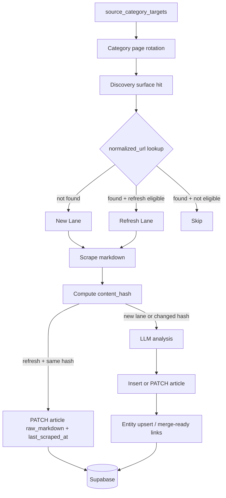

# BioMyne Koji P2B Refresh Lane 與 Category Discovery 交付計畫

> **版本**：v1.0
> **日期**：2026-07-08
> **狀態**：repo 已實作，待 `sql/005_p2b_refresh_and_category_targets.sql` 部署與完整 live rollout 驗證
> **模式**：deep + strict
> **目標分數**：文檔與實作最終 review 均需達到 95+/100
> **依賴前提**：P2A 已完成並通過 live validation（`normalized_url`、`content_hash`、`source_discovery_state`、credit capture 已驗證）

---

## 1. 執行摘要

P2B 的真正目標不是單純「再多抓一些文章」，而是把 Koji 從 **new URL intake pipeline** 升級成 **new + refresh 雙通道 pipeline**，同時補上兩個資料價值缺口：

1. 已知 URL 的內容更新偵測能力
2. `raw_markdown` 與足夠資訊密度的 `summary` 持久化能力

本文件同時扮演兩個角色：

1. **交付記錄**：說明本次 request 已在 repo 內實作的 P2B slice
2. **deployment gate**：明確標示哪些部分已經過本地 / live narrow validation、哪些仍待 migration deployment 後再做 full rollout 驗證

本次交付把 P2B 收斂成 5 個 slice，而且這 5 個 slice 已經在 repo 內落地：

1. **Refresh policy**：existing article 不再一律被 `article_exists()` 擋掉，而是能進入 bounded refresh lane
2. **Category target routing**：新增 `source_category_targets` 表，讓 category / TOC page 成為 map 之前的高信號 discovery surface
3. **Raw markdown persistence**：把 Firecrawl 回傳的全文 markdown 寫入 `articles.raw_markdown`
4. **Summary quality uplift**：把過短的 2-3 句摘要提升為可讀的 executive summary，並放寬 dashboard preview 的 destructive truncation
5. **Entity merge utility**：提供 canonical-name-driven merge job，避免 P2A canonicalization 之後仍殘留歷史碎片

這一版刻意**不**把 P2C budget governance、scheduler orchestration、或 self-host provider abstraction 混進來。P2B 只處理 freshness、signal density、與資料完整性。

### 1.1 目前部署狀態

| 項目 | 狀態 |
| --- | --- |
| Repo code | ✅ 已完成 |
| `sql/005_p2b_refresh_and_category_targets.sql` | 🟡 已編寫，尚未在 live Supabase 套用 |
| `raw_markdown` / longer summary | ✅ 已完成並做窄驗證 |
| refresh unchanged write path | ✅ 已對 live Supabase 做窄驗證 |
| category target live runtime | 🟡 需等 `sql/005` 部署後再做 spot-check |
| entity merge utility | ✅ dry-run 已驗證可讀 live Supabase |

---

## 2. 問題定義

### 2.1 本交付前的缺口（已在 repo 補齊）

| 缺口 | 交付前現況 | 風險 |
| --- | --- | --- |
| Refresh lane 不存在 | `_discover_article_urls.py` 對 existing article 只有 boolean skip，沒有 refresh eligibility 與 lane metadata | preprint revision、journal correction、news follow-up 永遠不會再被抓到 |
| Category target 不存在 | 只有 RSS / sitemap / map；沒有 `source_category_targets` 與 per-target stop condition | map-only 來源信號密度偏低，且缺乏高相關補充面 |
| `raw_markdown` 未寫回 DB | schema 有 `articles.raw_markdown`，但 write path 沒有帶入 | 原始內容丟失，dashboard 的 raw markdown tab 會長期空白 |
| Summary 過短 | 當時 prompt 只要求短摘要，且沒有 summary floor retry | 老闆 / 使用者無法靠 summary 快速理解 article substance |
| Dashboard preview 再次裁短 summary | feed card 當時把 summary preview 壓得過短 | 即使模型摘要變長，UI 仍會過度壓扁資訊 |

### 2.2 P2B 的完成定義

P2B 完成不代表 Koji 已經擁有 fully automated freshness engine。完成定義是：

1. existing article 能被 refresh policy 有條件地重新抓取
2. refresh lane 能分辨 `content_hash unchanged` vs `content_hash changed`
3. unchanged refresh 不再重跑 LLM，但會更新 `last_scraped_at` 與 `raw_markdown`
4. changed refresh 會覆寫 article 的摘要 / tags / entities / fingerprint
5. category target 可從 DB 讀取並做 bounded page discovery
6. raw markdown 與更高密度的 summary 能在 DB 與 dashboard 中被看到

---

## 3. 範圍

### 3.1 In Scope

- `sql/005_p2b_refresh_and_category_targets.sql`
- `sources` refresh policy 欄位
- `source_category_targets` table + 初始 seeding
- `_discover_article_urls.py` refresh-aware lookup 與 category-page discovery
- `_scrape_markdown.py` 回傳 `content_hash`
- `_analyze_article.py` 輸出 `raw_markdown` 並提升 summary 要求
- `_write_pipeline_output.py` 支援 existing article PATCH（refresh changed / unchanged）
- `run_pipeline.sh` refresh lane orchestration
- entity merge utility script
- dashboard feed preview summary 長度調整

### 3.2 Out of Scope

- scheduler / cron automation
- P2C budget mode、自動 conserve / critical throttling
- self-host Firecrawl provider abstraction
- full semantic near-duplicate clustering
- ML-based entity resolution

---

## 4. 解法總覽



核心設計原則：

1. **new lane 與 refresh lane 在 discovery 階段就分流**，而不是等到 write 階段才猜
2. **content_hash 是 refresh lane 的 LLM cost gate**
3. **raw_markdown 不依賴 LLM**，它是 scrape 結果的 first-class data
4. **category target 是 DB-backed config，不是散落在 script 裡的 hard-coded list**

---

## 5. 資料模型變更

### 5.1 `sources` refresh policy 欄位

本次已在 migration 中新增：

```sql
alter table sources add column if not exists refresh_enabled boolean not null default false;
alter table sources add column if not exists refresh_window_days integer;
alter table sources add column if not exists refresh_cadence_hours integer;
alter table sources add column if not exists refresh_priority text not null default 'low';
```

用途：

- `refresh_enabled`：來源是否允許進 refresh lane
- `refresh_window_days`：article 發布後幾天內還值得 refresh
- `refresh_cadence_hours`：最小 refresh 間隔
- `refresh_priority`：`high|medium|low`，供後續 P2C budget mode 使用

### 5.2 `source_category_targets`

```sql
create table if not exists source_category_targets (
  id uuid primary key default gen_random_uuid(),
  source_id uuid not null references sources(id) on delete cascade,
  name text not null,
  url text not null,
  priority text not null default 'medium',
  enabled boolean not null default true,
  check_frequency_hours integer not null default 24,
  last_seen_url text,
  last_seen_published_at timestamptz,
  last_checked_at timestamptz,
  last_error text,
  error_type text,
  detected_at timestamptz,
  created_at timestamptz not null default now(),
  updated_at timestamptz not null default now(),
  unique (source_id, url)
);
```

### 5.3 `articles` 補強欄位

P2A 已有 `last_scraped_at`、`content_hash`、`analysis_fingerprint`。P2B 再補：

```sql
alter table articles add column if not exists last_content_changed_at timestamptz;
```

用途：

- `last_scraped_at` = 最近一次 refresh / scrape 檢查時間
- `last_content_changed_at` = 最近一次 **確認內容有變更** 的時間

`last_content_changed_at` **不會**在 unchanged refresh 時更新；unchanged refresh 只更新 `last_scraped_at`。這是刻意的欄位語意，不是 bug。

---

## 6. Refresh Policy

### 6.1 Eligibility 規則

對於 existing article，只有同時滿足以下條件才進 refresh lane：

1. `refresh_enabled = true`
2. `published_at` 存在，且 article 年齡 `<= refresh_window_days`
3. `last_scraped_at` 為空，或距今 `>= refresh_cadence_hours`

### 6.2 初始預設政策

| Source type | refresh_enabled | refresh_window_days | refresh_cadence_hours | 理由 |
| --- | --- | --- | --- | --- |
| `preprint` | true | 30 | 168 | revision 重要，7 天 cadence 可接受 |
| `journal` | true | 30 | 720 | correction / update 稀少，但仍值得保守追蹤 |
| `news` | true | 7 | 72 | breaking / follow-up / correction 多出現在發布後數日 |
| `BioCentury` | false | null | null | paywall + 低變更傾向，初期不做 refresh |

### 6.3 Refresh 分流規則

| 情況 | 行為 |
| --- | --- |
| existing article + hash 未變 | 不跑 LLM；PATCH `raw_markdown`, `content_hash`, `last_scraped_at`, `crawl_run_id`，並保留 `last_content_changed_at` 不變 |
| existing article + hash 已變 | 跑 LLM；PATCH summary / tags / notes / raw_markdown / fingerprint / `last_content_changed_at` |
| existing article + 不符合 refresh policy | skip |

---

## 7. Category Discovery 設計

### 7.1 選擇原則

category target 不是取代 RSS/sitemap，而是補強兩類場景：

1. map-only 來源（如 Endpoints / BioCentury / SynBioBeta）
2. 需要高信號 supplement 的來源（如 Nature / Science / arXiv / bioRxiv）

### 7.2 執行方式

1. 從 `source_category_targets` 讀取當前 source 的 enabled targets
2. 只處理 `last_checked_at` 已超過 `check_frequency_hours` 的 targets
3. 以簡單 HTML anchor extraction 抓取 category / TOC page links
4. 使用 `last_seen_url` 作 per-target stop condition
5. 最多翻 `CATEGORY_TARGET_MAX_PAGES` 頁，避免 runaway crawl
6. 若 target error，寫回 `last_error` / `error_type`，但不阻斷整個 source，最後仍可 fallback 至 map

### 7.3 初始種子 target

本版 migration 以「每個來源至多 1 個高信號 target」為原則，先為 10 個來源預置 10 條 seeds，目的在於建立 runtime 與 state 機制，而不是一次把 target catalog 做滿。

---

## 8. Raw Markdown 與 Summary 品質策略

### 8.1 `raw_markdown`

`raw_markdown` 應視為 Firecrawl 對 article main content 的**原始正文 markdown**，不是模型摘要，也不是清洗後的二次輸出。

它的價值：

- 讓 dashboard 有原文 fallback
- 讓未來可重建 summary / entity extraction / embedding
- 在 LLM prompt 版本更新時可回放而不必重 scrape

### 8.2 Summary uplift

本次已把 prompt 從：

- `2-3 sentence summary of key findings`

提升成：

- `4-6 sentence executive summary covering actor, event, evidence, implications, and why it matters`

並加上一個 bounded quality gate：

- 若 summary 句數或長度低於 floor，重新要求模型擴寫一次

### 8.3 Dashboard preview

feed card 不應再把長摘要切到 110 字。這會讓高品質 summary 再次被 UI 壓扁。本次已提升到 220-260 字等級區間的 preview，detail panel 保留完整 summary。

---

## 9. Entity Merge Utility

P2A 的 canonicalization 只能保護未來新增資料，無法修復歷史上已經存在的 entity split。P2B 補一個 manual / scheduled utility：

1. 依 `canonical_name + entity_type` 找出重複 groups
2. 選擇 master entity（優先保留最早建立或被最多 article 引用者）
3. 重新掛接 `article_entities`
4. 清理 orphan duplicates

此工具先以 **manual script** 交付，不在本次直接掛 scheduler。

---

## 10. 交付檔案清單

| 類別 | 檔案 |
| --- | --- |
| Plan | `docs/phase1/p2b-refresh-and-category-delivery-plan.md` |
| Migration | `sql/005_p2b_refresh_and_category_targets.sql` |
| Pipeline | `ops/scripts/_discover_article_urls.py` |
| Pipeline | `ops/scripts/_scrape_markdown.py` |
| Pipeline | `ops/scripts/_analyze_article.py` |
| Pipeline | `ops/scripts/_write_pipeline_output.py` |
| Orchestration | `ops/scripts/run_pipeline.sh` |
| Utility | `ops/scripts/_merge_canonical_entities.py` |
| UI | `biomyne-koji-dashboard/src/app/(main)/dashboard/koji/feed/_components/feed-dashboard.tsx` |

---

## 11. 驗證策略

### 11.1 Narrow validation

- `python3 -m py_compile`：所有 touched Python helpers
- `bash -n`：`run_pipeline.sh`
- migration syntax sanity check
- category target query / parsing spot-check
- refresh candidate classification spot-check

### 11.2 Runtime validation

最小 live validation 與 pass criteria：

| 項目 | Pass criteria | 當前狀態 |
| --- | --- | --- |
| `raw_markdown` 寫入 | article row 的 `raw_markdown` 非空 | ✅ 已完成 |
| Summary uplift | sample article `summary_chars >= 220` 且 `summary_sentences >= 4` | ✅ 已完成 |
| refresh candidate classification | fixture 測試：eligible=True / recent=False / stale=False | ✅ 已完成 |
| unchanged refresh skip-LLM | live narrow validation 回傳 `articles_refreshed_unchanged = 1` | ✅ 已完成 |
| category target parsing | fixture 可抽出 next page 與 anchor links | ✅ 已完成 |
| category target live runtime | 部署 `sql/005` 後至少 spot-check 2 個 sources | 🟡 待部署 |

註：本表中的 `fixture` 指的是本次 delivery loop 內以 in-memory / one-off Python harness 執行的手動窄驗證，不代表 repo 內已經新增正式 pytest 測試檔。

---

## 12. 風險與緩解

| 風險 | 嚴重性 | 緩解 |
| --- | --- | --- |
| refresh policy 太寬，造成不必要 scrape | 中 | 初版用保守 cadence + window；P2C 再調 budget governance |
| category page HTML 結構漂移 | 中 | 記錄 target-level error，保留 map fallback |
| refresh PATCH 覆寫錯誤欄位 | 高 | 實作 explicit PATCH payload，並做 narrow live validation |
| summary 變長導致 UI 噪音 | 低 | 只放寬 preview，不在卡片直接全文展示 |
| entity merge 誤合併 | 中 | script 預設 dry-run / summary first，必要時再 apply |

---

## 13. 實作順序

1. Migration + seed defaults
2. `raw_markdown` / summary uplift
3. refresh-aware discovery classification
4. write-path PATCH for refresh changed / unchanged
5. category target discovery
6. entity merge utility
7. dashboard preview tuning
8. multi-round strict review + repair

---

## 14. Self-Audit（Mirror）

### DR-D1 Completeness
- 結果：PASS
- 說明：目標、範圍、schema、runtime、validation、risk、rollout 全部具備

### DR-D2 Accuracy vs Codebase
- 結果：PASS
- 說明：此文件已改為「repo 已實作 + deploy gate」描述；不再把已落地功能寫成未實作 gap

### DR-D3 Feasibility
- 結果：PASS
- 說明：設計維持 Bash + Python + Supabase 既有 control plane，不引入新 infra

### DR-D4 Consistency
- 結果：PASS
- 說明：P2B 的語彙與 P2 主規劃文件一致，未混入 P2C budget governance

### DR-D5 Risk Coverage
- 結果：PASS
- 說明：已列出 refresh, category drift, PATCH overwrite, entity merge 等主要風險

### DR-D6 Best Practices
- 結果：PASS
- 說明：採用 bounded refresh policy、raw data persistence、DB-backed target config、fallback-safe discovery routing

**Mirror Score（estimated）**：95/100
